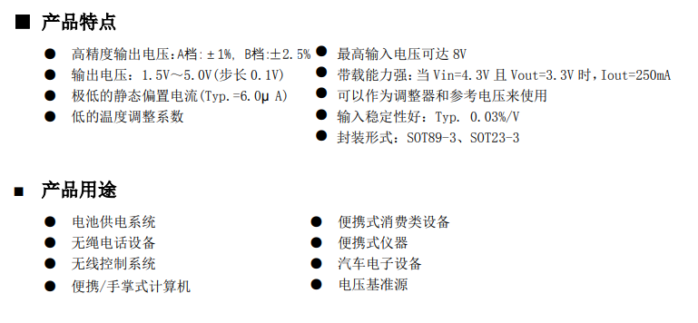

## 开始之前

各位同学，大家好，欢迎来到硬件考核作品制作指南。距离我们开始招新已经一个多月了，大家的学习进度现在如何呢？是不是已经开始着手制作硬件考核作品了呢？还是摸鱼摸到了现在？不管怎么样，这篇文章都会帮助到你的。

## 基本要求

硬件考核作品的基本要求如下：

- 不允许直接购买成品模块
- 模块 PCB 必须自行设计，不得使用现成的 PCB

如模块不符合规则，将会被视为无效作品。

此外还需要同学们注意以下几点：

- 模块应该根据需要留出接口，没有合理接口的模块将认定为不合格。
- 在模块丝印层上应该标注关键信息，例如电压，电源正负
- PCB 阻焊层建议使用绿色，方便对线路进行检查

## 作品:光线感应 LED

这个项目在我们的入门教程中，已经完整的讲解了如何制作。可以点击[这里](/docs/junior-hardware/07-project-1/)查看。这里不对技术原理进行额外介绍。

### 模块要求

- 5V 供电
- 光线敏感度可调
- 当光线强度低于阈值时，LED 灯亮起
- 当光线强度高于阈值时，LED 灯熄灭

## 作品:5V 转 3V3 模块

电压转换模块在电路中非常常见。智能车的电路设计中，经常需要将5V的电压转换为3.3V的电压，以便给模块和单片机供电。

### 模块要求

- 输入电压：5V 左右
- 输出电压：3.3v
- 输出电流： 至少 100mA
- 需要有指示灯来指示模块是否工作

### 技术方案

我们可以基于 XC6206P332MR 芯片实现这一需求，该芯片的详细信息可以参考：[https://item.szlcsc.com/324036.html](https://item.szlcsc.com/324036.html)

通过 LED 与限流电阻串联，可以实现指示灯的功能。

### 原理图

.png>)

## 作品:点动自锁 LED 灯

点动自锁开关是一种常见的开关，它可以在按下按键后切换并保持状态，直到下一次按下按键。

### 模块要求

- 5V 供电
- 带有 LED 灯，用来表示状态
- 带有一个按键，用来切换状态
- 按下按键后，LED 灯亮起，并且保持亮起的状态
- 再次按下按键后，LED 灯熄灭，并且保持熄灭的状态

### 技术方案

可以采用 YUSIJIE-01LM 芯片实现此功能，该芯片的购买链接与详细信息请参考：[https://item.taobao.com/item.htm?id=530401110404#](https://item.taobao.com/item.htm?id=530401110404#)

此芯片提供按键自锁和驱动功能，可以实现我们的需求。

### 原理图

.png>)

## 补充说明

如果自己设计过比上面提到的更复杂的模块，也可以提交自己的作品。另外，以上模块所提供的技术方案仅作为参考，如果你有更好的方案，也可以采用自己的方案来实现。
