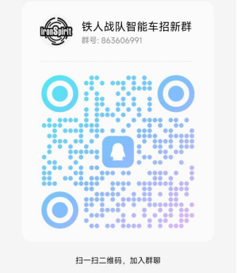

## 团队介绍

铁人战队智能车实验室(明理楼c203)是西南石油大学电信院最主要的学科竞赛团体之一,主要参与的赛事有**全国大学生智能汽车竞赛**, **全国大学生电子设计竞赛**, **蓝桥杯**, **四川省机器人大赛**等多项赛事, 为实验室团队成员提供活动场所以及经费支持. 如果你是电子技术爱好者, 或者是想让专业所学得以实践锻炼, 那么智能车团队欢迎你的加入。

## 招新时间

该招新活动为常驻活动，即日起开始招新。

## 面向人群

不限专业, 不限年级, 只要对电子技术，机器人感兴趣且愿意学习, 都欢迎你们的加入。

## 招新安排

本群主要选拔对象为参与19届(2024年)全国大学生智能车竞赛队员, 其次招收预备队员(主要为20届智能车竞赛预备队员).不论正式队员或者预备队员都可以参与前面介绍中提及的赛事活动(智能车赛项除外, 此赛项为团队协作, 且准备周期长, 不适合临时加入)。    

团队预计在下学期开学后, 不定期举办线上线下相结合的技能培训, 考核以及开展相关活动帮助新人提高技能, 以及玩得愉快. 培训主要为软件(单片机编程)培训, 以及硬件(pcb设计)培训, 活动则是围绕单片机制作诸如寻迹小车, 遥控车, 两轮平衡车一类的diy作品.   

智能车竞赛大概会在今年11月份公布赛题, 我们也会在11月份通过选拔考核确立19届智能车正式参赛队员, 然后正式队员便开始着手智能车竞赛备赛, 预备队友则是继续学习, 参与其余短期比赛锻炼.
选拔考核具体内容暂未确定, 初步想法是让参赛选手搭建相关单片机作品完成指定题目要求。

## 学习资源

请浏览我们的[文档](/docs/prologue/how-to-ask-question/)页面，目前文档正在施工中，因此目前放出的内容并非所有内容，如果你有任何问题，欢迎在群里提出。

## 招新群

我们建立了一个 QQ 群方便大家交流，扫描下方二维码即可加入。

