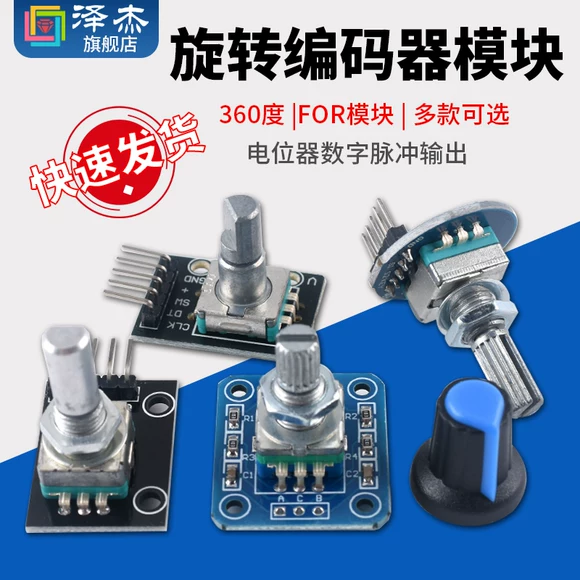
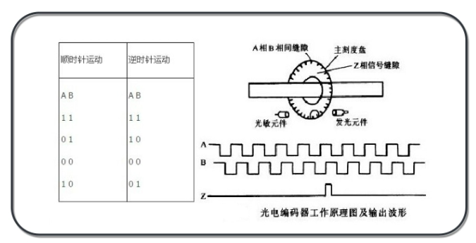
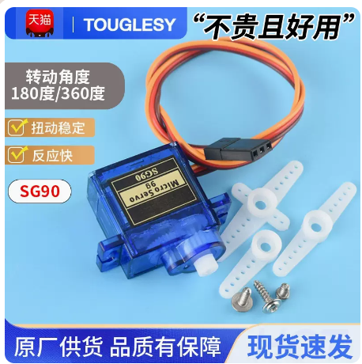

## 前言

软件考核作品项目早已发布，不过没有太多的详细说明，也没有提供一些实现的思路，在这篇文章里，我们将会提供一些实现的思路，以及一些细节上的注意事项，方便大家更好的设计自己的作品。

## 基本要求

软件考核作品的基本要求如下:

- 作品的核心逻辑实现必须是自己编写
- 编程语言必须使用 C 语言

此外，还有一些额外的要求:

- 作品应该运行在 51 单片机或者类 STM32 单片机上,且不能使用 Arduino 框架

## 作品:电机速度闭环控制

电机速度闭环控制通俗来说就是通过编程控制电机的转速，使得电机的转速在不同情况下都能保持在一个规定的值，而不会出现空载速度和负载速度不一致的情况。

电机速度闭环控制的实现思路如下:

### 传感器

既然我们需要控制转速，那么测量转速的传感器就是必不可少的。通常我们会用编码器来测量电机的转速。

有关编码器的详细介绍可以看这里:[https://zhuanlan.zhihu.com/p/592671918](https://zhuanlan.zhihu.com/p/592671918)

### 电机驱动

如果你事先学习过单片机，那么你应该知道单片机的 IO 口输出的电流是非常小的，所以不能像点灯一样直接将电机接到单片机的 IO 口上，这样会导致单片机 IO 口损坏。

那么，替代方案是什么呢？答案是电机驱动模块。

电机驱动模块的作用相当于一个可以被单片机控制的开关，它可以将单片机输出的电流放大，从而驱动电机。

我们可以用这一款电机驱动模块:[https://detail.tmall.com/item.htm?id=717996181216&skuId=5007479424763](https://detail.tmall.com/item.htm?id=717996181216&skuId=5007479424763)

驱动模块的资料，在商品详情页已经给出了，这里不多做介绍。

### 电机和编码器的购买

目前市面上独立的编码器比较昂贵，所以我们可以选择带有编码器的电机，这种电机加编码器的价格比较便宜，而且使用起来也比较方便。

可以购买类似这样的电机:[https://item.taobao.com/item.htm?id=601605175305#](https://item.taobao.com/item.htm?id=601605175305#)

### 电源

由于我们的电机功率比较打，因此普通的电源可能无法满足电机的工作，所以我们需要使用电池来为电机供电。如果只是为了学习，可以用 4 节1.5V 的干电池串联起来，对于个人来说，这样的电池成本比较低，而且方便携带。

为此，我们需要一个电池盒，可以在这个链接购买[https://detail.tmall.com/item.htm?id=18671310668&skuId=3420483933226](https://detail.tmall.com/item.htm?id=18671310668&skuId=3420483933226)

单片机的供电可以使用 USB 线供电，大部分单片机的系统板都提供电源接口。如果没有，可以考虑购买一个稳压模块，将电池的电压降到 5V，然后接到单片机的 5V 供电口。

### 速度测量

编码器的原理是旋转一周，就会产生固定数量的脉冲，我们通过单片机可以计算出固定时间内(比如 100ms)产生的脉冲数量，从而计算出电机的转速。

### 控制算法

有了上面的准备，我们就可以开始实现速度闭环控制了。有两种方案可以供参考。

#### 方案一：固定增量控制

这种方案的思路是，我们通过编码器测速电机速度，然后将测得的速度与我们期望的速度进行比较，如果测得的速度小于期望的速度，那么我们就固定增加电机的转速，如果测得的速度大于期望的速度，那么我们就固定减小电机的转速。

这个方案简单粗暴，当然也要很多缺点:

- 响应能力差，如果实际速度和预期速度相差很大，那么调整速度的时间就会很长
- 速度不稳定，因为我们只是固定增加或者固定减小电机的转速，所以电机的转速会在一个范围内波动

#### 方案二：PID 控制

PID 控制是一种比较常见的控制算法，有关算法的详细介绍可以参考这里:[https://blog.csdn.net/m0_38106923/article/details/109545445](https://blog.csdn.net/m0_38106923/article/details/109545445)

通过将实际速度与期望速度作为 PID 控制器的输入，我们可以得到一个控制量，这个控制量就是我们对电机的输出控制( PWM )。

### 作品的基本要求

- 能实现电机的速度闭环控制

## 作品:基于旋转编码器的数字舵机控制

### 旋转编码器

旋转编码器是一种可以测量旋转角度增量的传感器，它可以测量旋转的方向和旋转的角度。他们大致如下图所示:

旋转编码器在旋转其轴时会产生两个数字脉冲信号，这些信号称为 A 相和 B 相。A 相和 B 相的波形如下图所示:

通过单片机可以测量 A 相和 B 相的脉冲信号个数，从而计算出旋转过的角度以及旋转的方向。

### 数字舵机

舵机是一种常见是伺服电机，它可以通过控制信号来控制舵机的转动角度。数字舵机是一种可以通过数字信号来控制的舵机，它的控制信号是一种 PWM 信号，通过改变 PWM 信号的占空比，我们可以控制舵机的转动角度。

作为学习目的，购买一个比较便宜的舵机即可，例如这一款： [https://detail.tmall.com/item.htm?id=678498890304&skuId=4891585889747](https://detail.tmall.com/item.htm?id=678498890304&skuId=4891585889747)

舵机的控制信号是一种 PWM 信号，不过与电机控制不同，舵机的控制信号周期为 20ms，占空比为 0.5ms~2.5ms，其中 0.5ms 对应 0 度，1.5ms 对应 90 度，2.5ms 对应 180 度。

### 控制方案

我们可以在程序中设置一个变量，用来记录当前的舵机输出角度。然后定期读取旋转编码器的脉冲信号，根据脉冲信号的个数，计算出应该调整的角度(可以自行设定)，然后更新记录舵机输出角度的变量，最后将变量的值转换为 PWM 信号，输出到舵机。

### 作品的基本要求

- 能够根据旋转编码器的脉冲信号，调整舵机的角度
- 能够正确处理角度越界的情况(如在一个方向上角度调整到舵机上限后，继续调整角度，应该阻止角度更新，而不是出现异常)

## 作品:基于旋转编码器的LED调光

有关编码器部分请参考上一节内容。这个作品与上面的作品的区别在于，我们不需要控制舵机，而是控制 LED 的亮度。亮度的控制基于 PWM 技术。

### 作品的基本要求

- 能够根据旋转编码器的脉冲信号，调整 LED 的亮度
- 当亮度调整到最大或者最小时，能够正确处理极限的情况，内部记录值不应该继续增加或者减小。

## 作品:单按键控制多功能系统设计

在一些按键数量受限而功能又比较多的情况下，我们可以通过单按键不同的操作来实现多种功能。

### 功能需求

我们需要实现的功能如下:

通过程序逻辑实现一个按键的短按，长按，双击等操作，然后通过控制 LED 点亮方式，来表示切换不同的功能，例如单击一次点亮 LED，双击闪烁 LED，长按关闭 LED。

按键与 LED 模块均可从淘宝购买，也可使用开发板上的按键和 LED 模块(如果有)。

功能的实现可以参考这篇文章: [https://blog.csdn.net/pillarpeng/article/details/50999782](https://blog.csdn.net/pillarpeng/article/details/50999782)

### 作品的基本要求

- 能够实现按键的短按，长按，双击等操作
- 要有 LED 灯等指示类元件，来表示不同功能。
- 按键逻辑的实现不得有辅助类IC，必须是算法实现。
