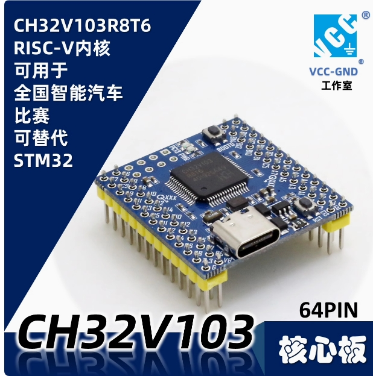
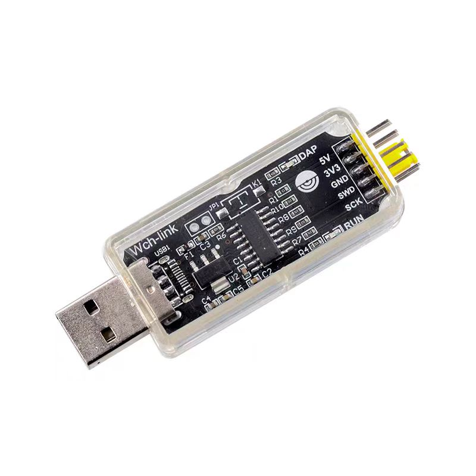
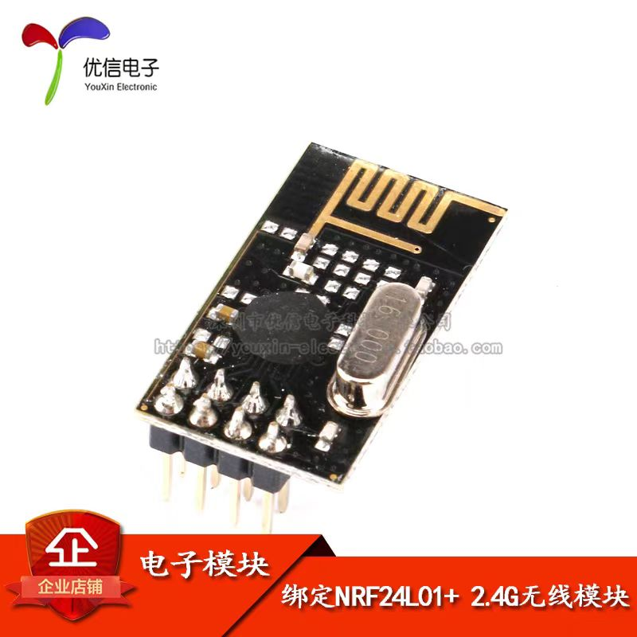

今年考核难度较大，在此给出软件推荐方案，以便初学者更快上手

## 开发板选择

考核限制使用沁恒mcu，推荐使用ch32v103c8t6, [购买链接](http://e.tb.cn/h.gpDuq3R2rnnneST?tk=h56036wUwDU)
下载器使用wch-link, [购买链接](http://e.tb.cn/h.gpO6SpUK9YJsc3M?tk=JwV936wNkZh)

## 无线模块选择

常用无线模块有lora,2.4ghz,4g,蓝牙等，推荐使用NRF24L01，2.4g模块，[购买链接](http://e.tb.cn/h.gKjrHRz2qk2LFeL?tk=e7YL36wjJAc)

## 车模选择

车模自行购买，车模类型不做要求，
