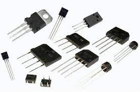

## 常见元件

电子元器件是构成电子产品的基本单元，它们有各种不同的类型和用途，例如电阻、电容、二极管、晶体管、集成电路等。每种元器件都有其特定的符号、参数、封装和引脚，你需要了解它们的基本知识和选型方法。以下是一些常用电子元器件的介绍：

### 电阻（Resistor）

电阻是一种用于限制电流的元件，它的作用是分压、分流、负载、保护等。，它的单位是欧姆（Ω）。电阻的阻值越大，通过它的电流就越小。电阻的阻值可以通过色环识别法来判断，也可以通过万用表来测量。电阻的封装有多种，例如贴片电阻、插件电阻、可调电阻等。

### 电容（Capacitor）

电容是一种储存电荷的元器件，它的作用是滤波、耦合、积分、微分等。电容的单位是法拉（F），它的符号是两个平行线。电容的参数包括容值（Capacitance）、工作电压（Working Voltage）等。电容有不同的类型，例如陶瓷电容、电解电容、钽电容、薄膜电容等。

### 二极管（Diode）

二极管是一种只允许单向电流通过的元器件，它的作用是整流、稳压、开关、信号检测等。二极管的单位是伏特（V），它的符号是一个三角形和一个竖线。二极管的参数包括正向压降（Forward Voltage Drop）、反向漏电流（Reverse Leakage Current）、最大正向电流（Maximum Forward Current）等。二极管有不同的类型，例如普通二极管、发光二极管（LED）、稳压二极管（Zener Diode）、肖特基二极管（Schottky Diode）等。

### 晶体管（Transistor）

晶体管是一种控制大电流通过的元器件，它的作用是放大、开关、振荡、调制等。晶体管的单位是安培（A），它的符号是一个圆圈和三条线。晶体管的参数包括放大系数（Amplification Factor）、饱和压降（Saturation Voltage Drop）、最大集电极电流（Maximum Collector Current）等。晶体管有不同的类型，例如双极型晶体管（Bipolar Junction Transistor, BJT）、场效应晶体管（Field Effect Transistor, FET）、金属氧化物半导体场效应晶体管（Metal Oxide Semiconductor Field Effect Transistor, MOSFET）等。

### 集成电路（Integrated Circuit, IC）

也是我们俗称的芯片，集成电路是一种将多个电子元器件集成在一个小型的半导体芯片上的元器件，它的作用是实现复杂的电路功能。集成电路的封装有多种，例如贴片封装、插件封装、双列直插封装、四列直插封装、球栅阵列封装等。集成电路有不同的类型，例如逻辑集成电路（Logic IC）、模拟集成电路（Analog IC）、存储器集成电路（Memory IC）、微控制器（Microcontroller, MCU）等。

以上是非常常见的元件，大部分的电路中都会用到它们。除此之外，还有一些其他的元件，例如电感、变压器、继电器、开关、传感器等，它们的作用各不相同，我们要根据需要选择合适的元件。

## 常见工具

### 万用表

万用表是一种用于测量电压、电流、电阻等的工具，它的作用是检测电路中的元件参数。万用表的参数包括测量范围、精度、分辨率等。万用表有不同的类型，例如数字万用表、模拟万用表、自动测量万用表等。如今我们常用的是数字万用表，它的使用方法如下：

1. 选择测量范围，例如电压、电流、电阻、通断等。
2. 将表笔插入正确的插孔，例如电压测量时，红色表笔插入VΩmA插孔，黑色表笔插入COM插孔。
3. 将表笔接触到待测电路的正确位置，例如电压测量时，红色表笔接触到待测电路的正极，黑色表笔接触到待测电路的负极。
3. 读取显示屏上的数值。

### 电烙铁

电烙铁是一种用于焊接电子元件的工具，它的作用是将电子元件焊接到电路板上。电烙铁的参数包括功率、温度、尖头等。电烙铁有不同的类型，例如温控电烙铁、恒温电烙铁、无铅电烙铁等。
元件的焊接操作很难通过文字来描述，建议还是观看下面的视频来学习焊接的方法，并且应该实践练习。在后面章节中，会更加详细地介绍焊接的方法。



### 热风枪

热风枪适合大范围加热的场景，例如焊接芯片(尤其是 QFN封装)、拆解多引脚的元件等等。其原理就是通过电热丝加热，然后通过风扇将热风吹出来。热风枪的参数包括功率、温度、风速等。在后续的教程中会详细介绍热风枪的使用方法。



### 剥线钳

剥线钳是一种用于剥去电线外皮的工具，它的作用是将电线的外皮剥去，露出内部的金属导线。剥线钳通常有多个剥线孔，每个剥线孔的直径不同，可以根据电线的直径来选择合适的剥线孔。

### 镊子

镊子是一种用于夹取小物件的工具，它的作用是夹取电子元件、电线、螺丝等。镊子有不同的类型，例如直镊子、弯镊子、尖嘴镊子、扁嘴镊子等。在焊接元件时，镊子可以用来夹持元件，防止烫伤手指。同时在焊接贴片元件时，镊子可以保证高精度的操控元件位置。

### 吸锡带

吸锡带是一种焊接辅助工具，它由一个可重复使用的带状材料制成，通常由铜或者钢制成。吸锡带的作用是在焊接过程中吸走多余的焊锡，一般用于手工焊接电路板和其他电子器件。

### 吸锡器

吸锡器的作用与吸锡带类似，它的原理是通过压缩空气产生负压，将多余的焊锡吸走。

## 练习

### 元件辨认

请从下面的图片中辨认元件。

### 上手焊接

可自行从淘宝等平台购买焊接练习套件，然后按照说明书进行焊接。焊接练习套件的难度不同，建议初学者从简单的焊接练习套件开始练习。

请保留一些未使用的焊接练习套件，后续的教程中会用到它们。
