在上一篇教程中，我们介绍了如何使用立创EDA绘制 PCB，绘制了一个简单的 LED 灯模块。在本篇教程中，我们将从概念的层面了解 PCB 的结构，以便更好的理解 PCB 的设计。

## 立创 EDA 中的 PCB 层

在 EDA 的编辑器中，我们可以看到右侧漂浮的 PCB 的层管理器，如下图所示：

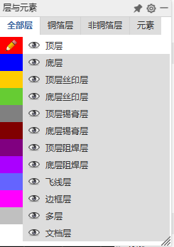

PCB 的层是 PCB 的组成部分，它们分别代表了 PCB 的不同部分，我们可以在 PCB 的不同层上绘制不同的内容，例如焊盘、丝印、飞线等。   
下面我们来了解一下 PCB 的层：

### 顶层

顶层是 PCB 的顶面走线或铜箔的层，这一层具有导电能力，我们绘制的导线以及元件的焊盘都在顶层。

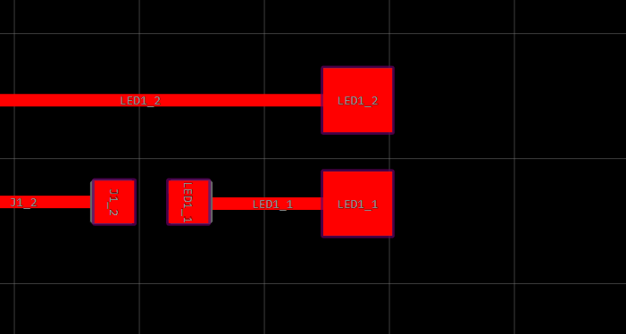

### 底层

底层与顶层类似，只不过在另一面而已。

### 丝印层

丝印层是 PCB 的丝印的层，我们可以在这一层绘制文字、图形等，用于标识元件的位置、方向、型号等信息。

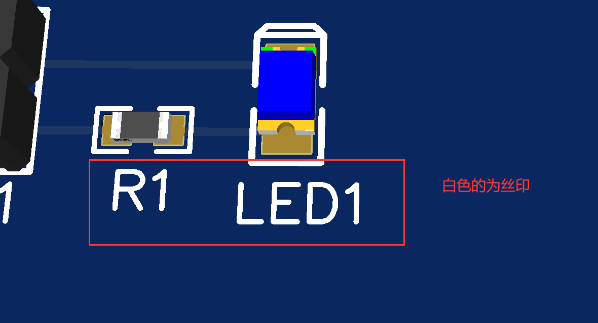

### 锡膏层

锡膏层是用来标识焊锡膏印刷位置的层，不会体现在单独的 PCB 上。在自动生产中，焊锡膏按照锡膏层的标识通过印刷的方式涂抹在 PCB 上，方便后续的自动焊接。

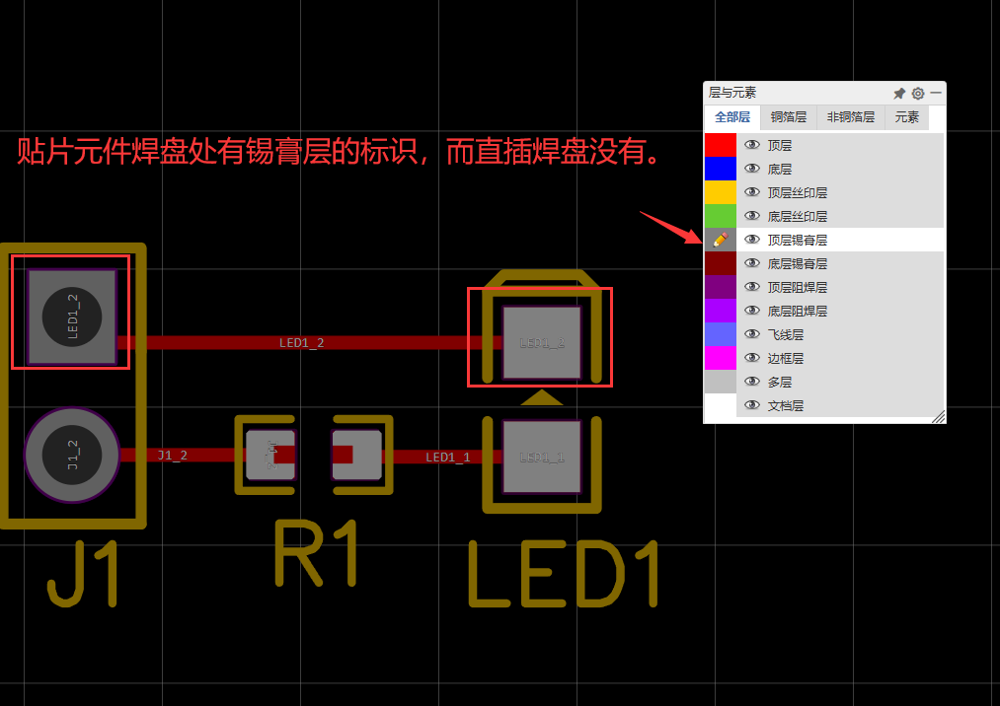

### 阻焊层

阻焊层用于表示阻焊材料的分别，我们常见电路板的绿色部分就是阻焊层。阻焊层可以保护 PCB 的焊盘，防止短路。

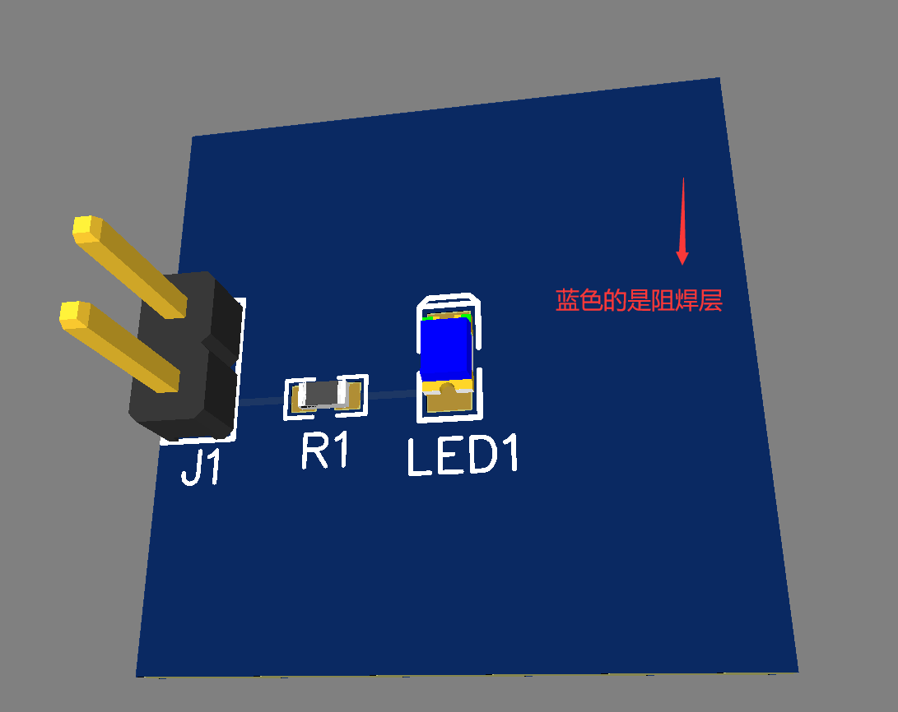

> 之所以大多数 PCB 采用绿色，是因为绿色 PCB 在早期的生产中，工人不容易产生视觉疲劳。如今现代化的生产线已经不需要考虑这个问题了，但因为绿色阻焊层已经成为了非常成熟的工艺，所以仍然大量使用。

> 在个人学习或者产品打样测试的时候，尽量不要选择深色阻焊层，因为深色阻焊层难以观察线路情况，不利于排查问题。

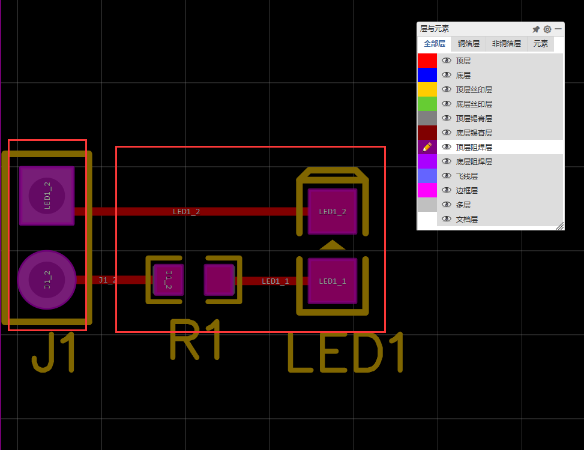

上图焊盘处有阻焊层的开窗，这是为了能够焊接，焊盘需要裸露出来。

### 飞线层

飞线层是 EDA 中的概念，用于表示元件之间的连接关系。在 PCB 中，飞线层不会体现在 PCB 上，但是在 EDA 中，我们可以通过飞线层来查看元件之间的连接关系。

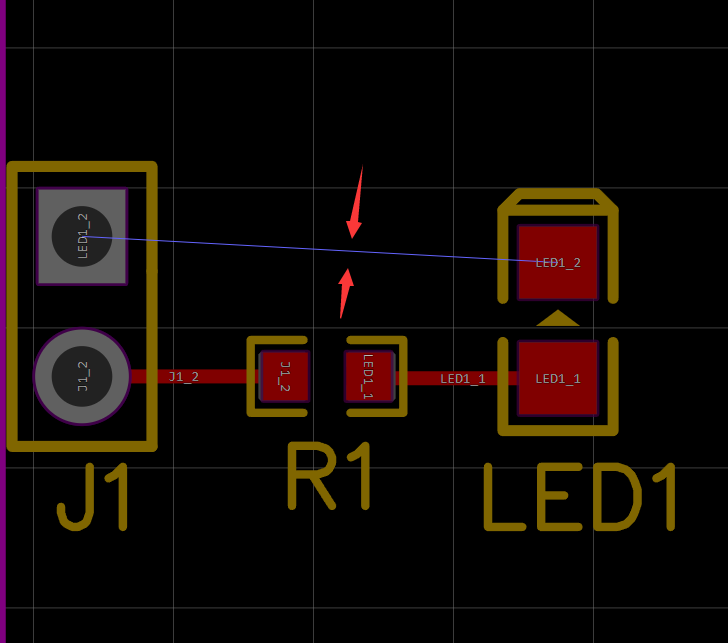

通过飞线层我们可以来确定元件的摆放位置和方向是否方便布线。在布线时也方便确认元件之间的连接关系。

### 边框层

边框层用来定义 PCB 的边界，我们可以在边框层绘制矩形、圆形等图形，用于定义 PCB 形状。

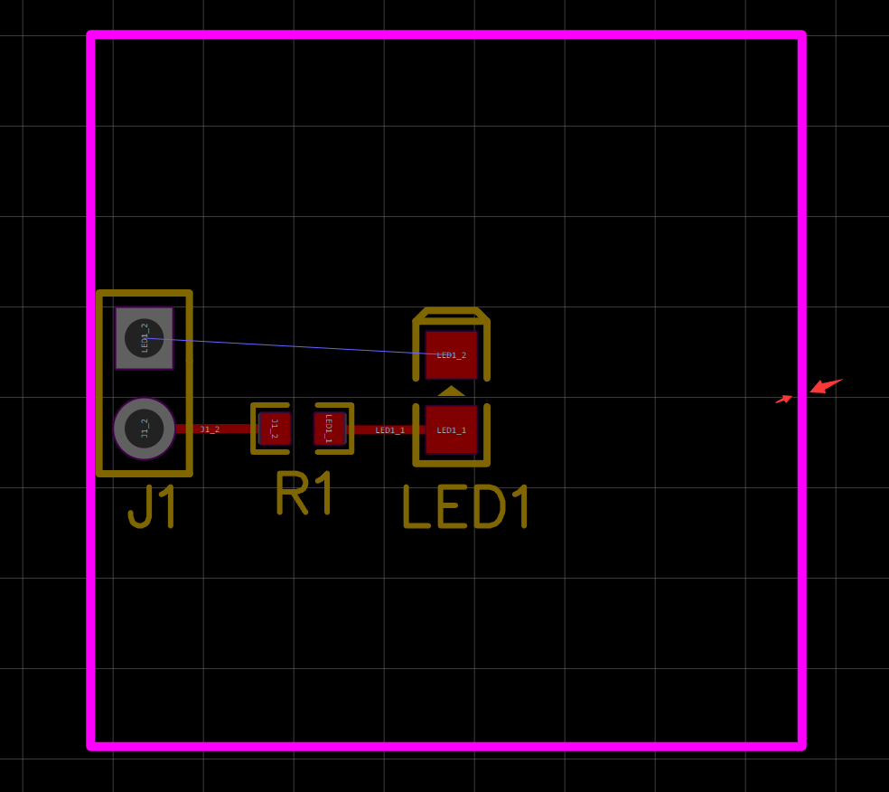

### 多层

多层一般用于放置一些贯穿 PCB 的元素，比如我们的排针焊盘，它们需要贯穿整个 PCB，因此放在多层中。

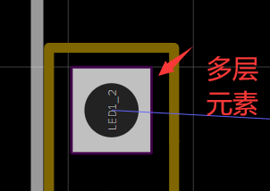

### 文档层

文档层同样不会体现在 PCB 中，也不会体现在生产过程中，它是用于存放一些文档的，例如 PCB 的尺寸，参考线、一些说明等。

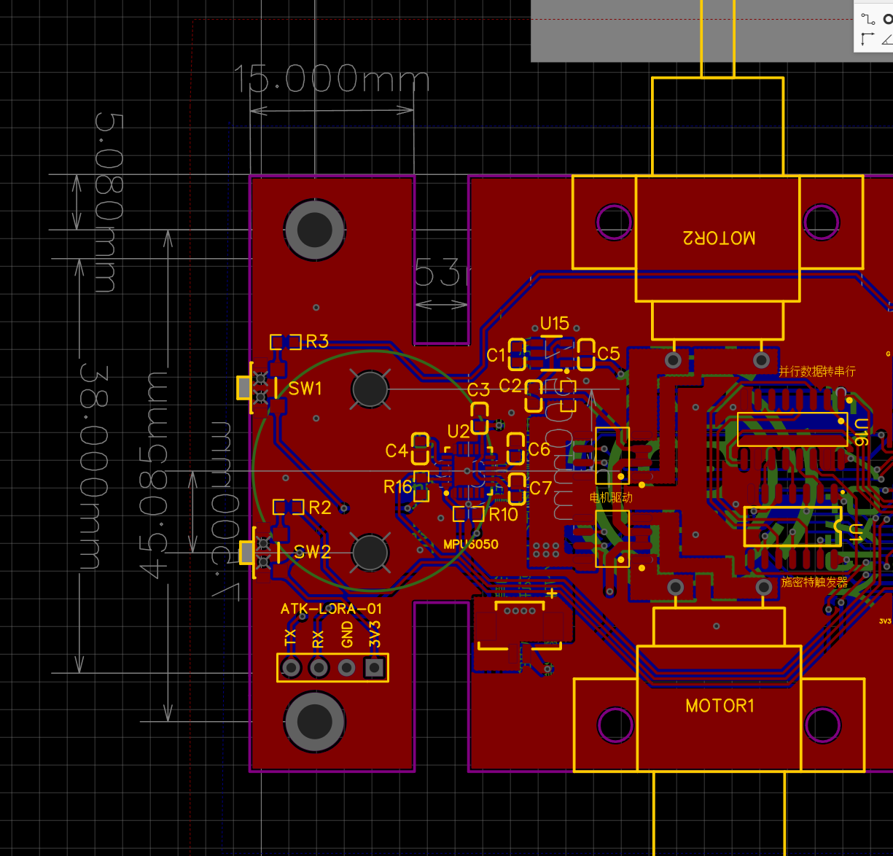

## PCB 的常见术语

PCB 板常用的术语通常包含焊盘、过孔、丝印、铺铜等，我们在绘制 PCB 时，需要了解这些术语的含义，也方便后续的学习。

### 焊盘

焊盘是 PCB 上的金属圆盘，用于焊接元件。焊盘的大小和形状取决于元件的封装，我们可以在元件的封装中定义焊盘的大小和形状。

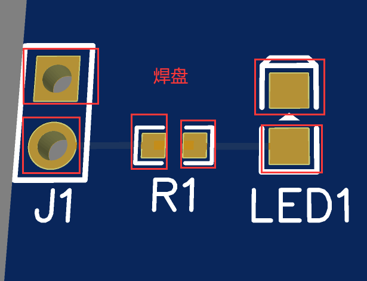

### 过孔

过孔是 PCB 上的金属圆柱，用于连接不同层的导线。在 PCB 上，我们可以通过过孔连接不同层的导线，从而实现导线的穿越。对于复杂的 PCB布局，过孔的是必然存在的。

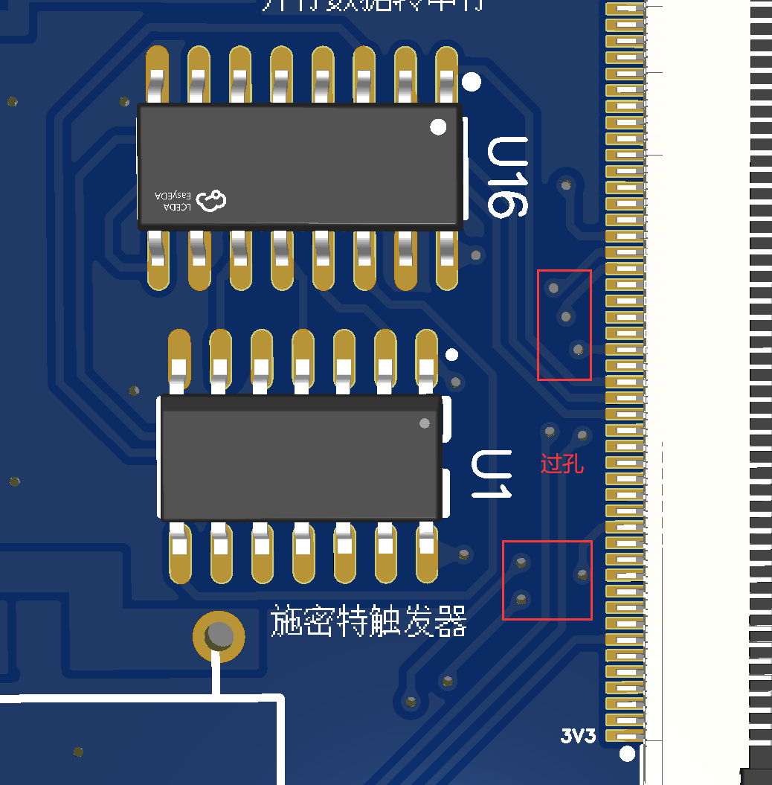

这是从网络上找到的过孔结构示意，方便你的理解。

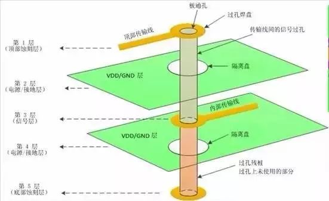

### 丝印

丝印是 PCB 上的文字、图形等标识，用于标识元件的位置、方向、型号等信息。丝印一般在 PCB 的顶层或者底层，我们可以在丝印层绘制丝印。

### 铺铜

铺铜指的是 PCB 上的大面积的铜箔，用于大功率导电，散热，以及信号屏蔽。

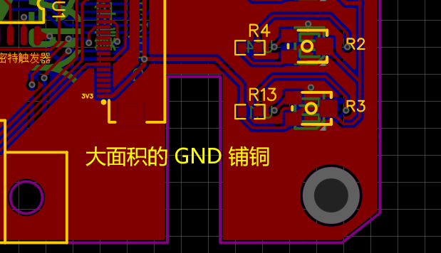

之前教程中我们尚未涉及到铺铜，之后我们将介绍铺铜的使用。

> VCC: 电源正极，VDD: 电源正极，GND: 地线，VSS: 地线。 除此以外，还有AVCC、AVDD、AGND、AVSS等。 AVCC、AVDD、AGND、AVSS 一般用于模拟电路。