在上一篇教程中，我们已经设计好了模块的 PCB 。在本篇教程中，我们将把 PCB 生产出来，并焊接元件，让电脑上的工程变成一个实际的模块。

## 安装嘉立创下单助手

虽然嘉立创的网站上有下单的功能，但是我们推荐使用嘉立创的下单助手。因为使用嘉立创的下单助手下单可以享受每月 2 次的免费 PCB 打样。

点击下面的链接，下载嘉立创下单助手，然后按照提示安装。

[https://www.jlc.com/portal/appDownloadsWithConfig.html](https://www.jlc.com/portal/appDownloadsWithConfig.html)

### 领取优惠券

打开嘉立创下单助手，在右侧的导航栏中，选择 `优惠券中心`，然后点击 `领取券领取` 按钮。

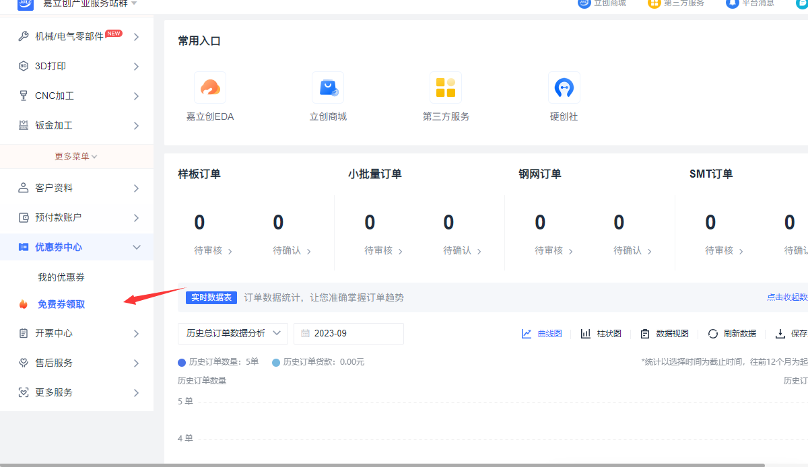

将页面滚动到`PCB+SMT 喷锡免费券·领券专区`,领取免费券。

## 导出 Gerber 文件

打开 PCB 文件，点击 `制造` -> `PCB 制板文件`，即可生成生产 PCB 所需的 Gerber 文件。

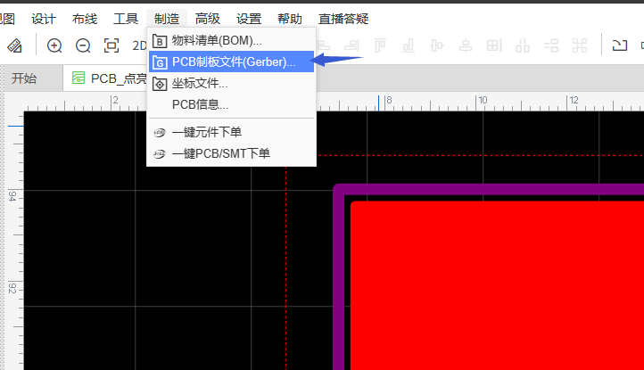

为了保证可生产性，我们需要在导出 Gerber 文件时，应该最后检查一次 DRC 错误。

点击`生成 Gerber`按钮，即可生成 Gerber 文件。

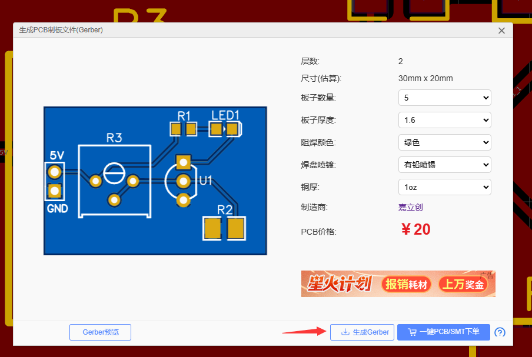

## 上传 Gerber 文件

打开嘉立创下单助手，点击首页的 `PCB/FPC 下单`

点击上传按钮，选择上一步导出的 Gerber 文件。

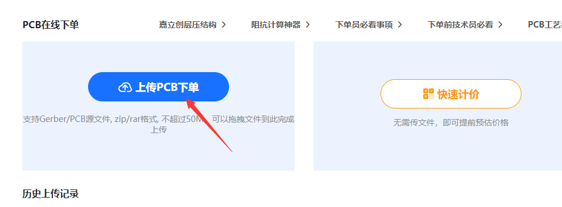

等待上传解析完成，将板子数量修改为 5，然后点击 `立即下单` 按钮。

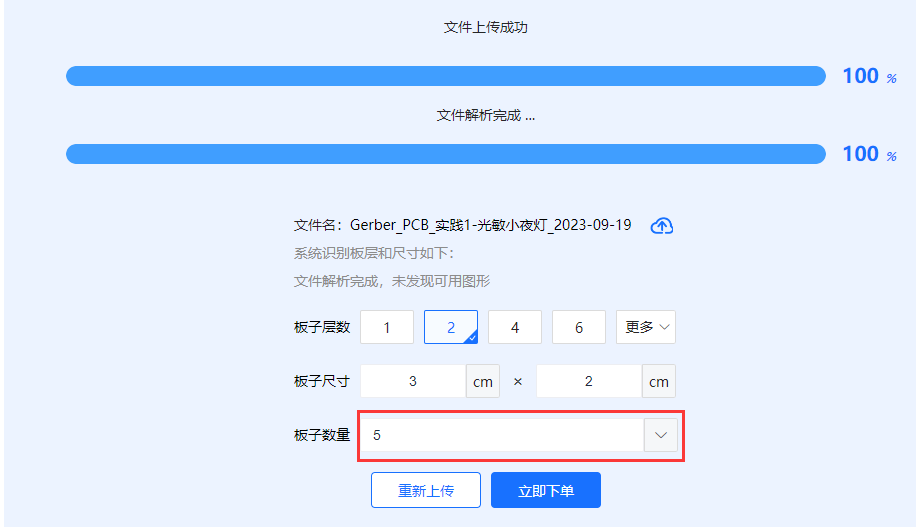

## 配置生产参数

板材类型一般选择选择 `FR-4`，也就是我们最常见的 PCB 板。

其他选项参考下图设置，请注意修改收货地址。

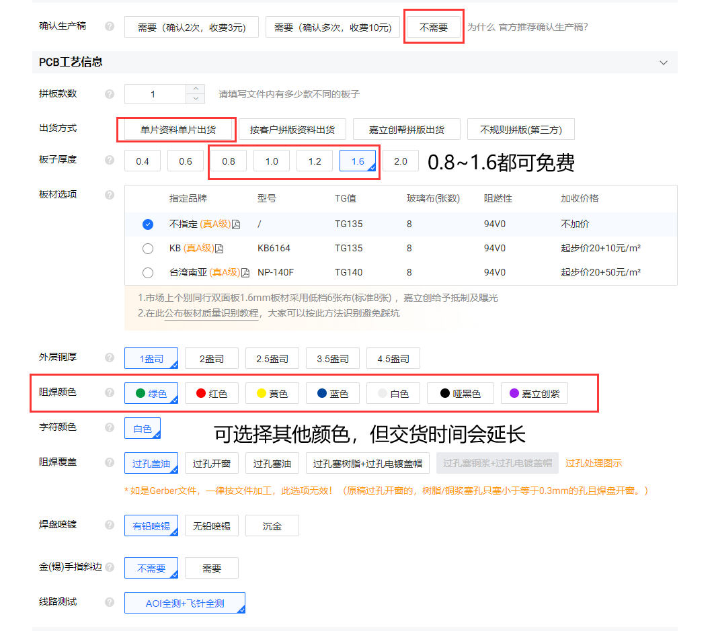

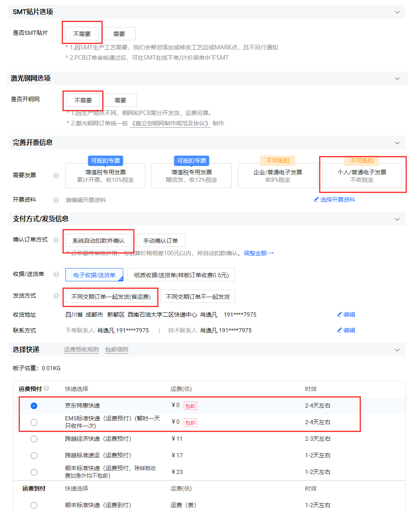

## 下单生产

选择之前领的免费券(由于演示账号的优惠券已经用完，这里没有展示)，点击 `提交订单` 按钮，即可完成下单。

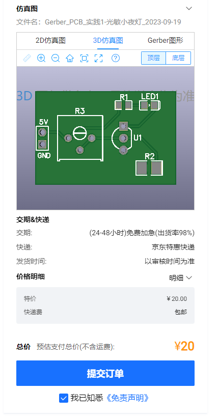

后续等待嘉立创工厂生产完成即可。

## BOM 下单

> BOM 是 Bill of Materials 的缩写，中文意思是物料清单。BOM 是 PCB 生产的必要文件，它包含了 PCB 上所有元件的信息，包括元件的型号、数量、位置等。BOM 文件可以帮助 PCB 工厂快速准确的生产 PCB 板。

回到 EDA 编辑器，选择 `制造` -> `物料清单(BOM)`，即可生成 BOM 数据。

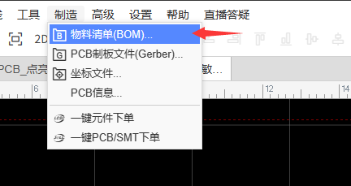

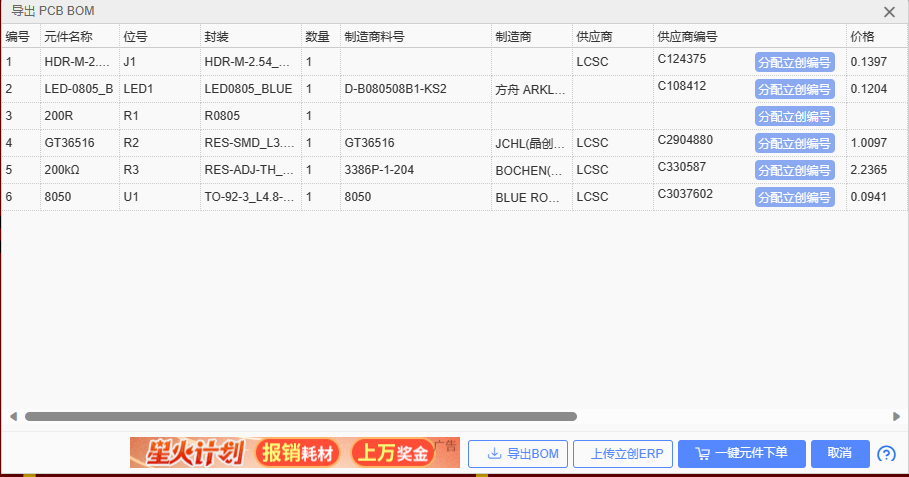

我们可以选择导出 BOM 文件，然后去其他网站下单。也可以选择“一键元件下单”。这里我们选择“一键元件下单”。

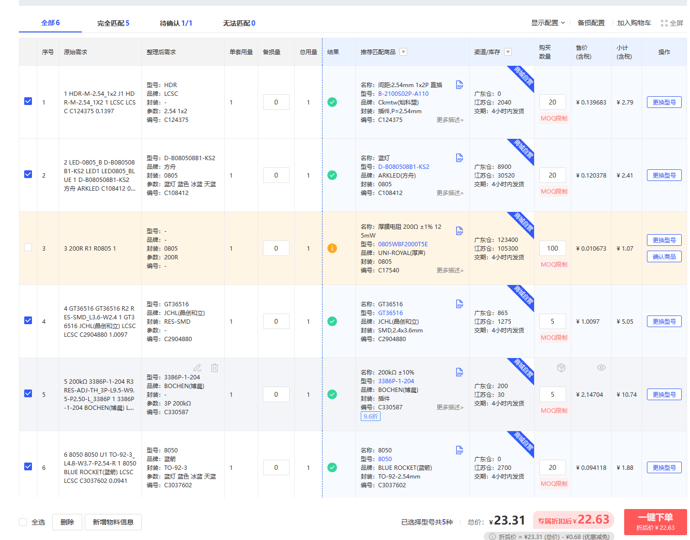

接下来需要仔细检查 BOM 数据，确保元件的型号、参数、封装等信息都是正确的。如果元件信息错误，点击右侧“更换型号”按钮，重新选择元件型号。

如果发现有元件价格跟预计有明显出入，可以点击右侧“更换型号”按钮，重新选择元件型号。这里以电位器为例子。

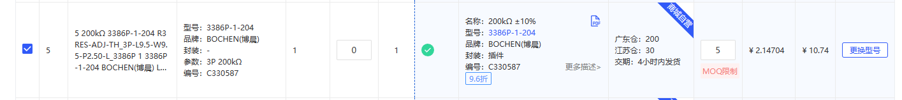

我们可以选择价格较低一点的作为替代。但是请注意，替代元件的参数要与原来的元件相同，否则可能影响电路效果。这里我们选择了价格较低的电位器，相比之下，没有了伸长轴，但是这不影响我们的使用。

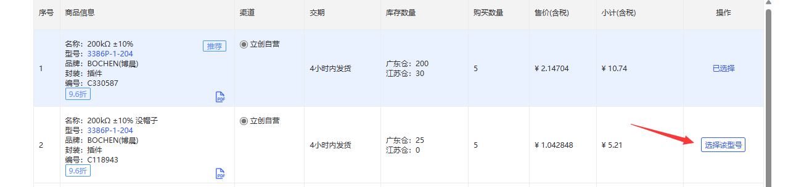

当元件表格中出现这种标识时，说明配单系统不确定元件是否正确，需要我们手动确认。确认匹配到的元件信息正确后，点击“确认商品”按钮，即可确认元件信息。

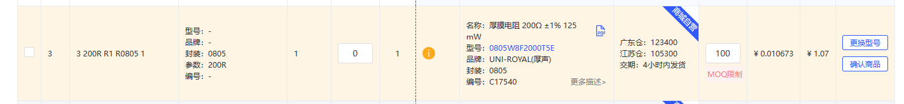

### 下单付款

点击“一键下单”按钮，即可生成订单，然后按照页面的付款提示完成付款即可。

### 个别元件下单

立创商城中可能找不到我们需要的元件，或者元件价格较贵(例如MPU6050芯片)，这时候我们可以选择其他网站下单，例如云汉芯城、淘宝等。在淘宝等非专业元件网站下单时，需要注意元件是否为正品，是否有售后服务等问题。

## 等待到货

我们已经完成了 PCB 和元件的下单，接下来就是等待 PCB 和元件到货了。在等待的时间里，建议准备好焊接所需的工具，并提前练习元件的焊接。

