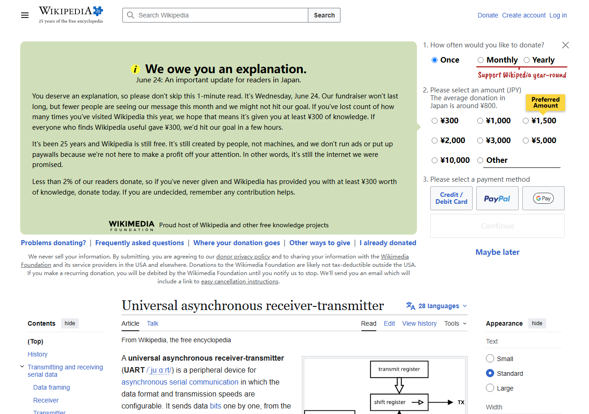
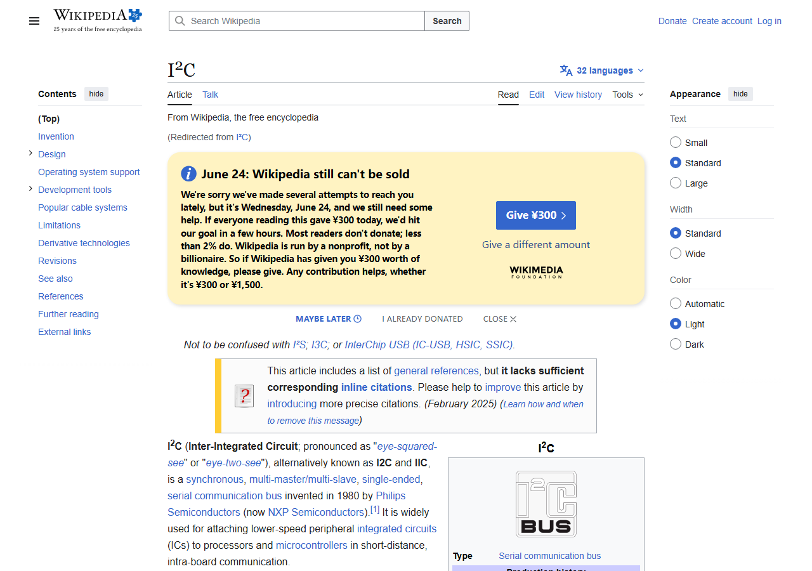
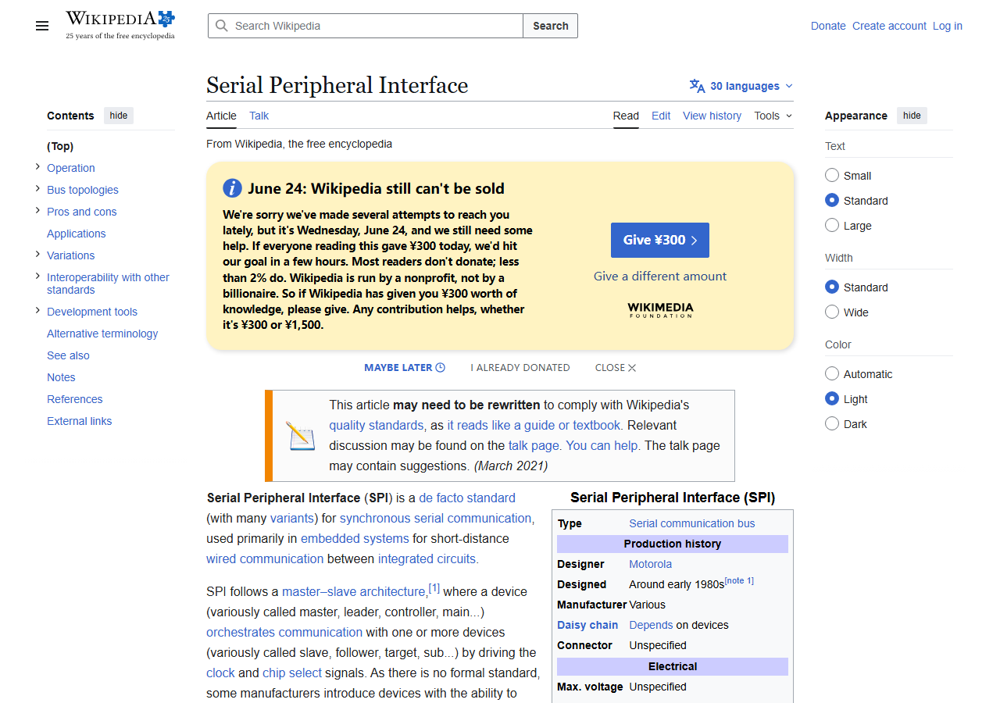

在智能车的硬件设计中，各种模块之间需要互相通信。比如：

- MCU 需要读取陀螺仪的角度数据
- MCU 需要通过蓝牙模块与手机通信
- 电调（电机驱动器）需要接收 MCU 的速度指令

这些通信都依赖各种**通讯接口**。本节将介绍嵌入式系统中最常见的三种通讯接口：**UART**、**SPI** 和 **I2C**。

## 通讯接口概述

| 接口 | 线数 | 通信方式 | 速度 | 典型距离 | 常见用途 |
|------|------|---------|------|---------|---------|
| UART | 2~3 线 (TX/RX/GND) | 异步、全双工 | 常见 115200bps | 数米 | 蓝牙模块、GPS、串口调试 |
| I2C | 2 线 (SDA/SCL) | 同步、半双工、多设备 | 100k~3.4Mbps | 同一块 PCB | 陀螺仪、OLED 屏幕、EEPROM |
| SPI | 4 线 (MOSI/MISO/SCK/CS) | 同步、全双工 | 数 Mbps~数十 Mbps | 同一块 PCB | LCD 屏幕、高速 ADC、Flash 存储 |
| CAN | 2 线 (CAN_H/CAN_L) | 差分、半双工、多主 | 最高 1Mbps | 数十米 | 汽车、工业控制、机器人 |

### 同步 vs 异步

- **同步通信**（SPI、I2C）：有一根专门的**时钟线**，由主设备发送时钟信号来控制数据传输节奏
- **异步通信**（UART）：没有时钟线，通信双方约定好速率（波特率），各自根据内部时钟判断数据

### 全双工 vs 半双工

- **全双工**（UART、SPI）：数据可以**同时**双向传输（像对讲机，双方能同时说话）
- **半双工**（I2C、CAN）：数据同一时刻只能**一个方向**传输（像对讲机的 PTT 模式，一方说完另一方才能说）

---

## UART（串口）

UART（Universal Asynchronous Receiver/Transmitter，通用异步收发器）是最简单、最常用的通信接口。通过 USB 转 TTL 模块连接到电脑，就是我们常说的"串口调试"。

### 硬件连接

UART 使用两根信号线：

```
MCU_TX  ────────  模块_RX    （发送端接对方接收端）
MCU_RX  ────────  模块_TX    （接收端接对方发送端）
MCU_GND ────────  模块_GND   （共地！）
```

> **关键规则**：TX（Transmit，发送）接对方 RX（Receive，接收），RX 接对方 TX。**一定不能忘了接 GND！**

### 信号电平

UART 接口的电平标准有多种，连接时要注意电平匹配：

| 电平标准 | 逻辑0 | 逻辑1 | 常见场景 |
|----------|------|-------|---------|
| **TTL (3.3V)** | 0V | 3.3V | 大多数 STM32 模块 |
| **TTL (5V)** | 0V | 5V | 51 单片机 |
| **RS-232** | +3V ~ +15V | -3V ~ -15V | 电脑 DB9 串口（已少见） |

> 将 5V 电平的信号直接接入 3.3V 的 MCU 可能会损坏芯片！如果电平不匹配，需要使用电平转换芯片（如 TXS0108E）或分压电阻。

### 在原理图中表示 UART

在电路图中，UART 接口通常用排针或座子引出：



一般会标注 `TX`、`RX`、`GND` 等网络标签，方便识别。如果需要 3.3V 或 5V 供电（给外部模块供电），也可一并引出。

### 常见应用

- **USB 转 TTL 模块**：烧录 51 程序、串口调试
- **蓝牙模块（HC-05/HC-06）**：无线串口透传
- **GPS 模块**：输出 NMEA 定位数据
- **串口屏**：通过串口指令控制显示

---

## I2C（I²C 总线）

I2C（Inter-Integrated Circuit）是飞利浦（NXP）发明的两线制总线，特点是只需要 **两根线** 就能连接 **多个设备**。

### 硬件连接

```
MCU_SDA ──┬────┬────┬────  设备1_SDA
          │    │    │
MCU_SCL ──┼────┼────┼────  设备1_SCL
          │    │    │
        上拉   上拉  上拉
        电阻   电阻  电阻
          │    │    │
VCC ─────┴────┴────┴────
```

- **SDA**（Serial Data）：双向数据线
- **SCL**（Serial Clock）：时钟线，由主设备提供
- **上拉电阻**：SDA 和 SCL 都需要上拉到 VCC，常见阻值为 4.7kΩ

> I2C 的 SDA 和 SCL 线**必须加上拉电阻**，否则总线无法正常工作！这是初学者最容易犯的错误。

### 设备地址

I2C 总线上可以挂多个设备，每个设备有唯一的 **7 位地址**。MCU 通过地址来区分不同的设备：

- 同一个 I2C 总线上可以挂多个设备
- 每个设备地址必须唯一（有些设备可通过引脚配置地址）
- 通信时先发送地址，再发送数据

### 在原理图中表示 I2C



I2C 接口通常用 4 引脚引出：VCC、GND、SDA、SCL，常见于传感器模块接口。

### 常见应用

- **MPU6050/MPU9250**：六轴/九轴陀螺仪
- **OLED 显示屏**：0.96 寸 128x64 小屏
- **BMP280**：气压传感器
- **AT24Cxx**：EEPROM 存储芯片

---

## SPI

SPI（Serial Peripheral Interface）是摩托罗拉（Motorola）发明的高速串行接口，用 **4 根线** 实现全双工通信。

### 硬件连接

```
MCU_SCLK ───────────  设备_SCLK    （时钟）
MCU_MOSI ───────────  设备_MOSI    （Master Out, Slave In）
MCU_MISO ───────────  设备_MISO    （Master In, Slave Out）
MCU_CS   ───────────  设备_CS      （片选）
```

- **SCLK**（Serial Clock）：时钟线
- **MOSI**（Master Out Slave In）：主设备发送数据
- **MISO**（Master In Slave Out）：从设备发送数据
- **CS**（Chip Select，也称 SS/SSEL/NSS）：片选信号，低电平有效

### 片选机制

与 I2C 用地址区分设备不同，SPI 通过**片选引脚（CS）**来区分：

- 每个 SPI 从设备需要一根独立的 CS 线
- MCU 拉低某个 CS，即可选中对应的设备进行通信
- 设备多了之后，CS 引脚消耗较多

### 在原理图中表示 SPI



SPI 接口通常引出 6 引脚：VCC、GND、SCLK、MOSI、MISO、CS，有时还会多引一根中断引脚（INT）。

### 常见应用

- **LCD/OLED 屏幕**：高速刷屏
- **W25Qxx Flash**：外部程序/数据存储
- **NRF24L01**：2.4G 无线通信模块
- **SD 卡**：数据存储

---

## 接口对比与选择

| 特性 | UART | I2C | SPI |
|------|------|-----|-----|
| 最少线数 | 2 (TX+RX) | 2 (SDA+SCL) | 4 (MOSI+MISO+SCLK+CS) |
| 最大速率 | ~1Mbps | 100k~3.4Mbps | 10~50Mbps |
| 多设备支持 | 不支持（一对一） | 支持（最多127个） | 支持（需额外CS引脚） |
| 通信距离 | 数米 | 同一PCB | 同一PCB |
| 全双工 | ✓ | ✗ | ✓ |
| 硬件复杂度 | 简单 | 简单 | 较简单 |
| 协议复杂度 | 简单 | 较复杂 | 简单 |

### 选择建议

- **串口调试、简单通信、GPS/蓝牙模块** → UART
- **多个低速传感器、省钱省引脚** → I2C
- **高速传输、LCD 屏幕、Flash 存储** → SPI
- **汽车/工业环境、远距离、抗干扰** → CAN

---

## CAN 总线简介

在智能车竞赛（如全国大学生智能汽车竞赛）中，一些高性能车模会用到 CAN 总线：

- **差分信号**：CAN_H 和 CAN_L 是一对差分信号，抗干扰能力强
- **多主通信**：总线上任意节点都可以主动发送数据
- **仲裁机制**：多个节点同时发送时，优先级高的自动胜出
- **错误检测**：CRC 校验、位填充等机制保证数据可靠性
- **终端电阻**：CAN 总线两端需要各接一个 120Ω 终端电阻

CAN 总线在工业控制和汽车电子中广泛应用。如果你将来参与电控方向，这是一项值得深入学习的协议。

---

## PCB 走线注意事项

在设计 PCB 时，通讯接口的走线需要特别注意：

1. **差分线**（如 CAN、USB D+/D-）：两线等长、平行走线，阻抗匹配
2. **高速信号**（如 SPI SCLK）：尽量短、远离敏感模拟信号
3. **I2C 上拉电阻**：放在靠近 MCU 的位置
4. **接口防护**：引出到外部的接口建议加 ESD 保护二极管
5. **信号完整性**：高速信号下方应有完整的 GND 参考平面

---

## 推荐阅读

- [I2C 总线规范 (NXP)](https://www.nxp.com/docs/en/user-guide/UM10204.pdf)
- [STM32 UART 应用笔记](https://www.st.com/resource/en/application_note/an2606-stm32-microcontroller-system-memory-boot-mode-stmicroelectronics.pdf)
- [SPI 总线入门 (Analog Devices)](https://www.analog.com/en/analog-dialogue/articles/introduction-to-spi-interface.html)

---

掌握了通讯接口的基础知识，你在设计电路时就能更好地理解各模块之间的连接方式，在绘制原理图时选择最合适的接口类型。
