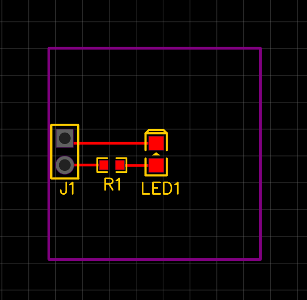
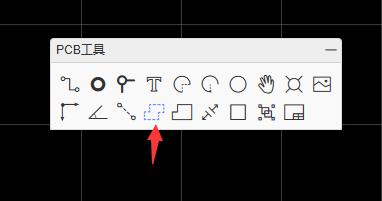
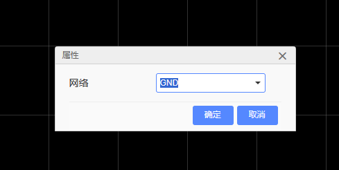
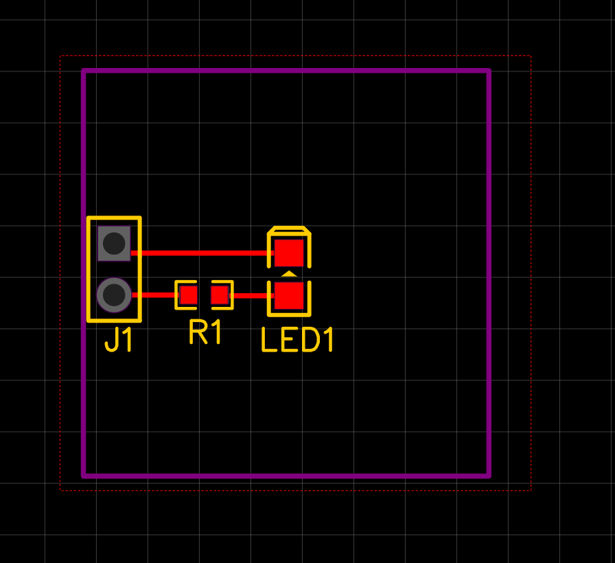
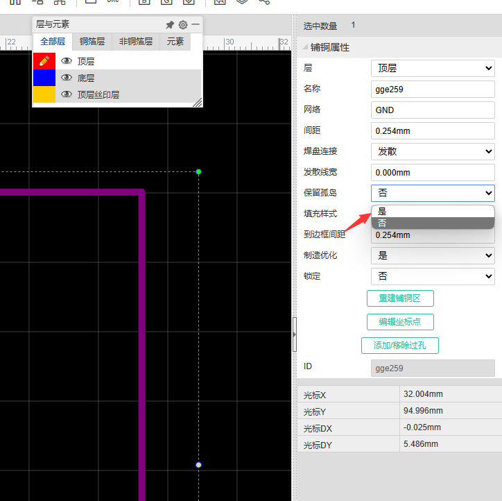
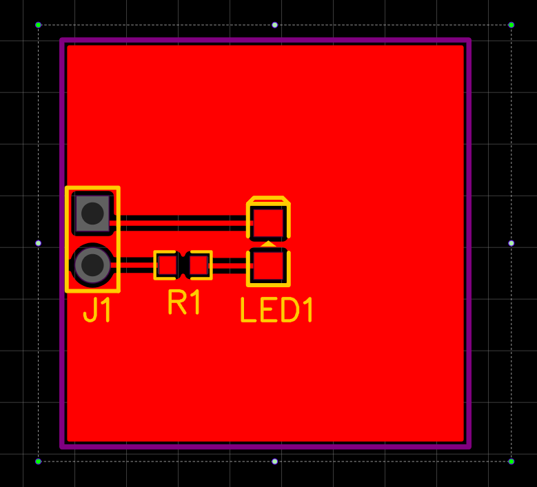
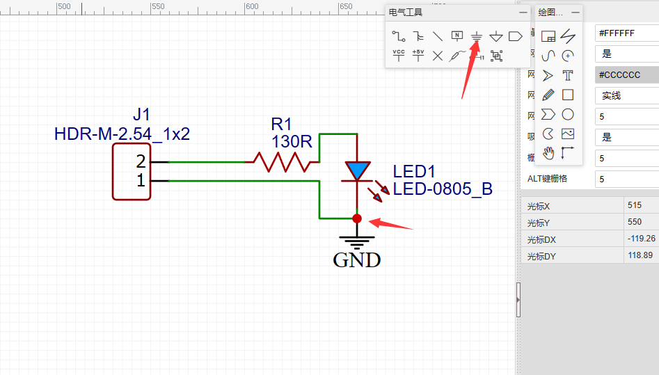
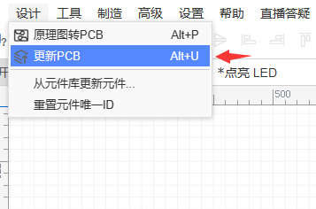
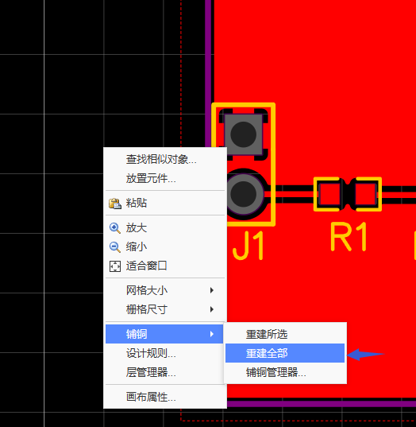
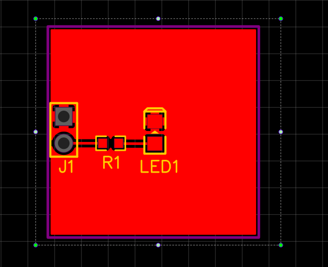

上一篇教程中，我们提到了 PCB 铺铜，但是并没有详细介绍。在本篇教程中，我们将详细介绍 PCB 铺铜的作用和方法。

## 铺铜的作用

### 降低 GND 阻抗

> 阻抗: Impedance，是电路中电流和电压的比值，单位为欧姆，用于描述电路对交流电的阻碍程度。

在数字电路中，由于数字信号的特点，会在 PCB 上产生较大的噪声，这些噪声会影响电路的稳定性。而通过铺铜，可以降低 GND 的阻抗，提高吸收噪声的能力。

### EMC 电磁兼容

> EMC: Electromagnetic Compatibility，电磁兼容，是指电子设备在其电磁环境中，以及与其他设备共存时，不产生电磁干扰，同时也不会对其环境产生电磁干扰的能力。

通过大面积的电源或 GND 铺铜，可以有效的屏蔽电磁波，提高电路的抗干扰能力。同时也减少电路对外的辐射，降低对其他电路的干扰。

### 散热

通过铺铜，可以增加发热元件的散热面积，提高散热效率。

### 大功率电路

对于大功率电路，可以通过铺铜的方式，增加电路的电流承载能力。

## 铺铜方法

我们以之前教程中的 LED 灯模块为例，介绍铺铜的方法。

由于我们的目前的电路很简单，也不存在大功率或发热元件，因此我们只需要全部铺铜 GND 即可。我们可以通过以下步骤铺铜：

1. 选择 PCB 工具中的铺铜

2. 设置需要铺铜的网络

> 网络: Net，是 PCB 中的一个概念，它是一组相互连接的元件的集合，例如 GND 网络就是所有连接到 GND 的元件的集合。

3. 设置铺铜区域

点击鼠标左键即可设置固定点，令红色虚线围成需要铺铜的区域，点击鼠标右键结束设置。

嗯？为什么没有铺铜呢，我们再看看右侧铺铜的属性，现在请选中铺铜边框，然后查看右侧属性。

将保留孤岛选项设置为“是”，我们可以看到铺铜区域显示出来了。

铺铜被认为是孤岛，说明我们的电路没有 GND 网络，因此需要修改一下原理图。

修改完成后，我们更新一下 PCB，以便将修改同步到 PCB 中。

回到 PCB 编辑器后，我们右键空白处，选择“铺铜-重建铺铜”，即可完成铺铜。

现在焊盘的 GND 与铺铜正确连接了，即使关掉“保留孤岛”选项，铺铜也正常显示了。

本教程中只是初步了解铺铜，有关铺铜的更多内容，可以自行深入学习。