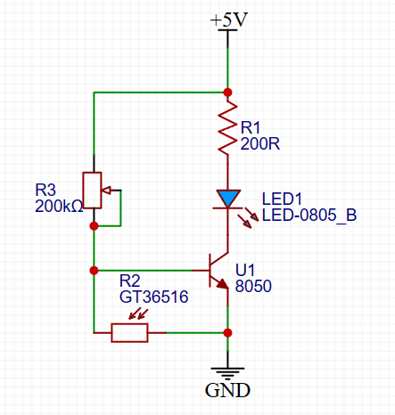
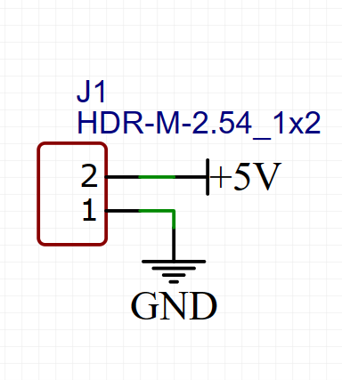
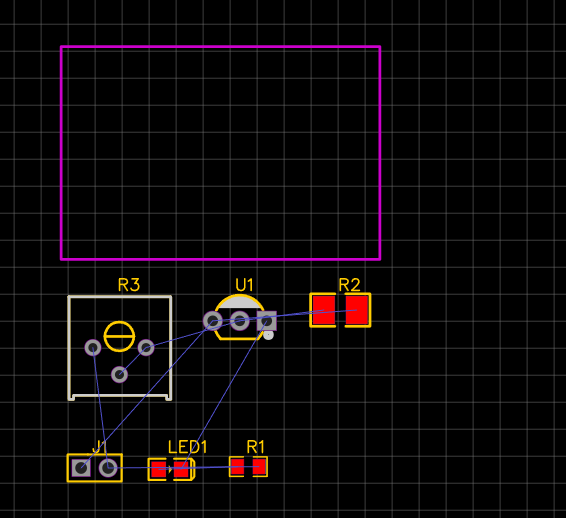
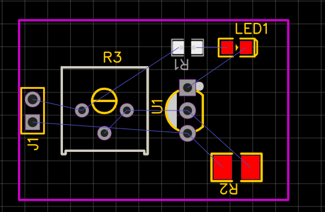
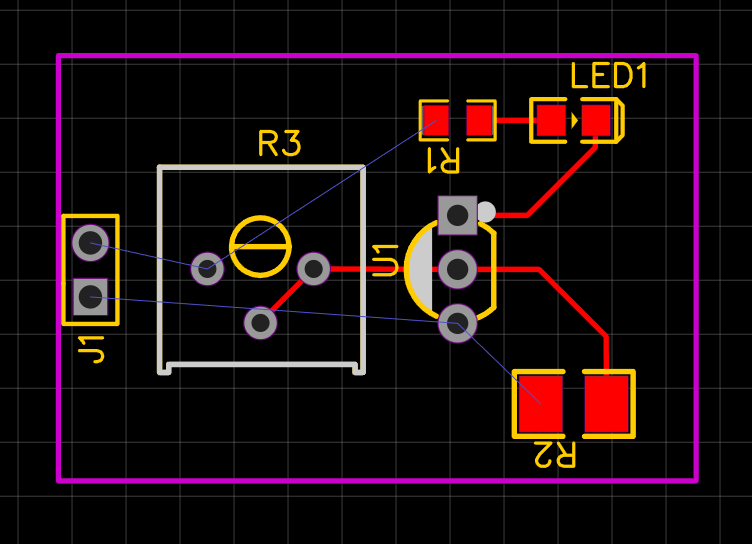
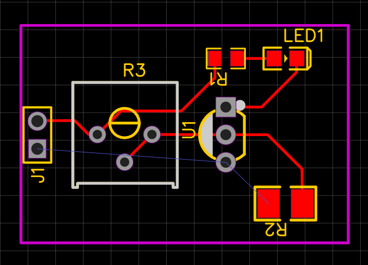
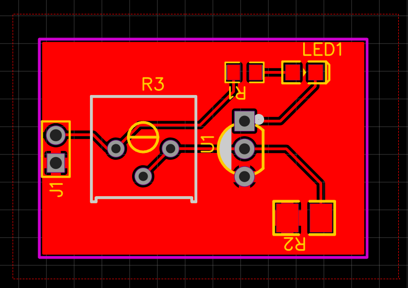
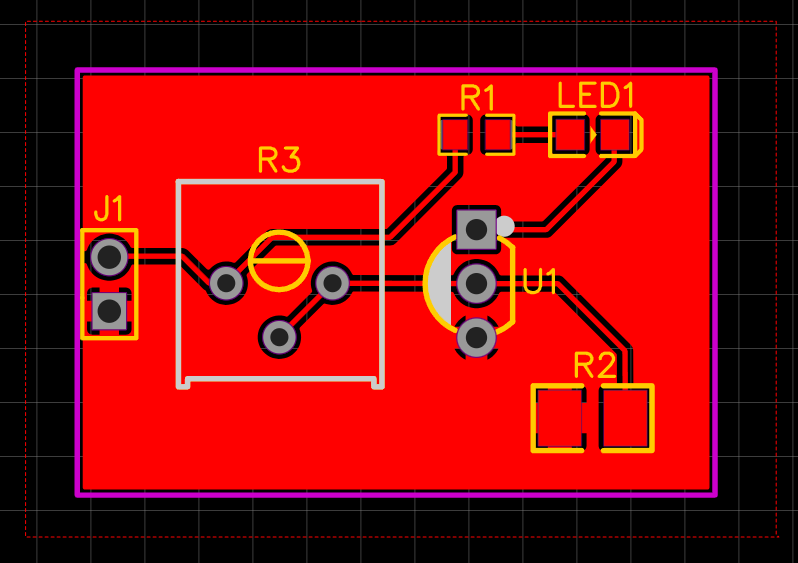
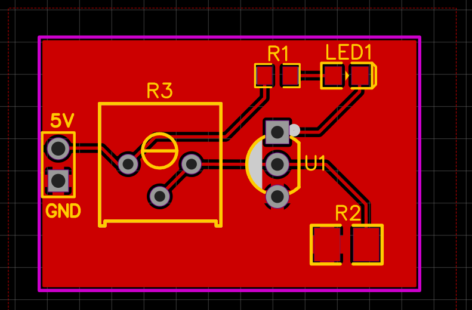
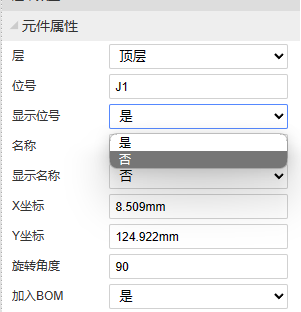

我们已经学习了电路设计的基础知识，以及 EDA 软件的使用。在本篇教程中，我们将通过一个实际的项目，来实际体验一下电路设计的流程。

## 设计目标

- 能够根据光线强弱，自动点亮与熄灭
- 能够调整灵敏度
- 低电压供电(5v)

## 设计方案

### 电源

为了让电路简单，我们采用外接 5V 直流电源。5V 直流电源可以通过 USB 线供电，也可以通过常见的电源模块供电，适用性很广。

### 光线检测

我们需要一个元件来检测环境光的强弱，这里我们采用光敏电阻。光敏电阻的阻值与光照强度成反比，利用这个特性，我们可以实现光线强度的测量。

### 自动控制

我们需要设计一个电路，能根据光敏电阻的阻值，来控制 LED 灯珠的亮度。这里我们采用一个 NPN 型晶体管来实现这个功能。

## 电路设计

在准备设计一个电路之前，先搜索一下相关的资料，看看有没有类似的电路设计。这里我们可以搜索关键词 `光敏电阻 夜灯`，找到了一个类似的电路设计:

[https://blog.csdn.net/qq_51272949/article/details/121115820](https://blog.csdn.net/qq_51272949/article/details/121115820)

这个电路设计的功能与我们的需求相似，我们可以参考这个电路设计，来设计我们的电路。

电路中 R1 为限流电阻，LED1 为我们的灯珠，R2 为光敏电阻，R3 为电位器，U1 为 NPN 型晶体管。

这个电路的原理是，当光敏电阻阻值较大时，U1 的基极电压较低，U1 无法导通，LED1 无法点亮。当光敏电阻阻值较小时，U1 的基极电压较高，U1 导通，LED1 点亮。通过调节 R3 的阻值，可以调节光敏电阻的阻值，从而调节灵敏度。

由于元件型号众多，为了避免在模仿原理图时出错，下面列出了我们使用的元件信息:

| 元件 | 参数/型号 | 备注                 | 立创编号 |
| ---- | --------- | -------------------- | -------- |
| R1   | 200R      | 0805 贴片电阻        |          |
| LED1 | 无        | 0805 任意色 LED 灯珠 |          |
| R2   | GT36516   | 光敏电阻             | C2904880 |
| R3   | 200K      | 可调电位器           | C330587  |
| U1   | 8050      | NPN 型晶体管         | C3037602 |

> 元件的立创编号可以在 [https://www.szlcsc.com/](https://www.szlcsc.com/) 搜索对应元件。也可在编辑器元件库处搜索。

**接下来不要忘记添加电源接口！** 我们设计的模块想要投入使用，必须要有电源接口，这里我们依然使用排针作为电源接口。

## 绘制 PCB

在绘制 PCB 之前，我们需要先确定 PCB 的尺寸。这里我们使用 2cm x 3cm 的 2 层 PCB 板，这样的尺寸可以满足我们的需求。

### 元件布局

我们需要将元件放在合适的位置上，元件的布局应该符合以下原则:

- 尽量减少导线的长度
- 尽量减少导线的数量
- 元件之间距离合适，不要影响焊接或者使用
- 接口类元件应该放在 PCB 板的边缘，方便使用
- 元件应该尽量均匀分布，不要集中在一起

调整布局后，可以通过 3D 预览功能查看 PCB 的效果。

### 走线

走线是 PCB 设计中最重要的一步，走线的好坏直接影响 PCB 的性能。走线时应该遵循以下基本的原则:

- 尽量减少导线的长度
- 尽量减少过孔数量
- 先连接信号线，再连接电源线，最后连接地线
- 不允许出现直角走线

按照以上原则，首先连接信号线

然后是5V电源线

对于 GND，我们有两种选择，一种是直接通过导线连接，另一种是通过铜皮连接。我们的电路不涉及信号问题，所以我们可以通过铜皮连接 GND。

### 丝印

不用忘记调整丝印。丝印是印刷在 PCB 板上的文字或者图案，如果不进行调整，整个电路板会显得很乱。同时我们需要一些说明文字，来帮助使用者了解电路板的使用方法。

元件位号丝印调整后的效果如下:

我们还要在电源接口处标识出电源的正负极，这样才能保证电路板的安全使用。

对于一些位号不重要的元件，我们可以隐藏位号，这样可以减少丝印的混乱程度。

## 生产制造

我们已经完成了 PCB 的设计，现在可以保存好文件，接下来就是 PCB 的生产制造。在下一篇教程中，我们将介绍如何将 PCB 提交给制造厂商进行生产制造。
