> 学习本教程前，建议先阅读[硬件入门准备](/docs/junior-hardware/component-and-tools/)，以获得更好的体验。

在本节的教程中，我们将绘制一个点亮 LED 的电路，来初步体验电路设计中的原理图的绘制。在这个过程中，我们将学习如何使用立创 EDA 在线编辑器，以及如何绘制原理图。

## 创建立创 EDA 项目

打开网址[https://lceda.cn/editor](https://lceda.cn/editor)，访问立创 EDA 在线编辑器。

点击左上角菜单，选择 “文件-新建-工程...” 创建一个新的项目。

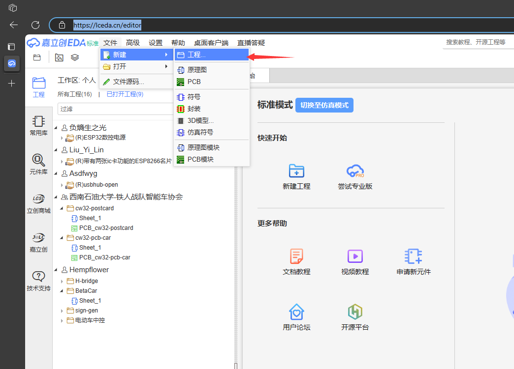

在弹出的新建工程窗口中，输入项目名称，例如 `点亮 LED`，点击 “确定” 创建项目。

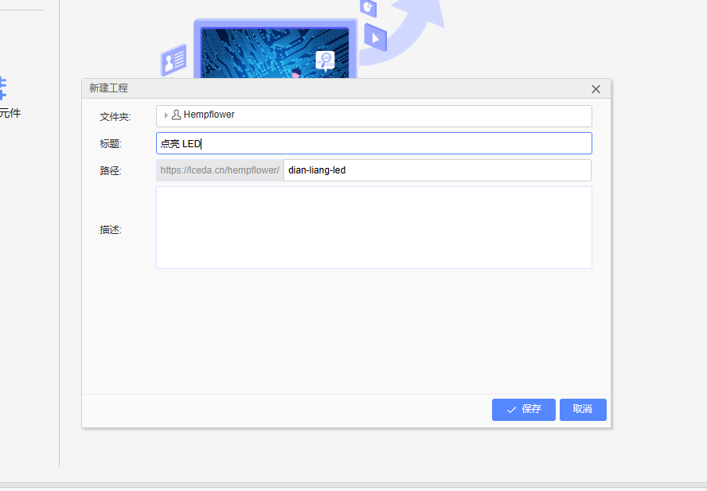

创建完毕后，会自动打开新项目的原理图编辑界面。

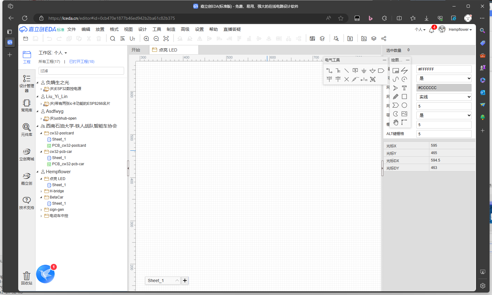

## EDA 界面介绍

我们先简单了解一下 EDA 的界面，以便后续学习基本的使用。

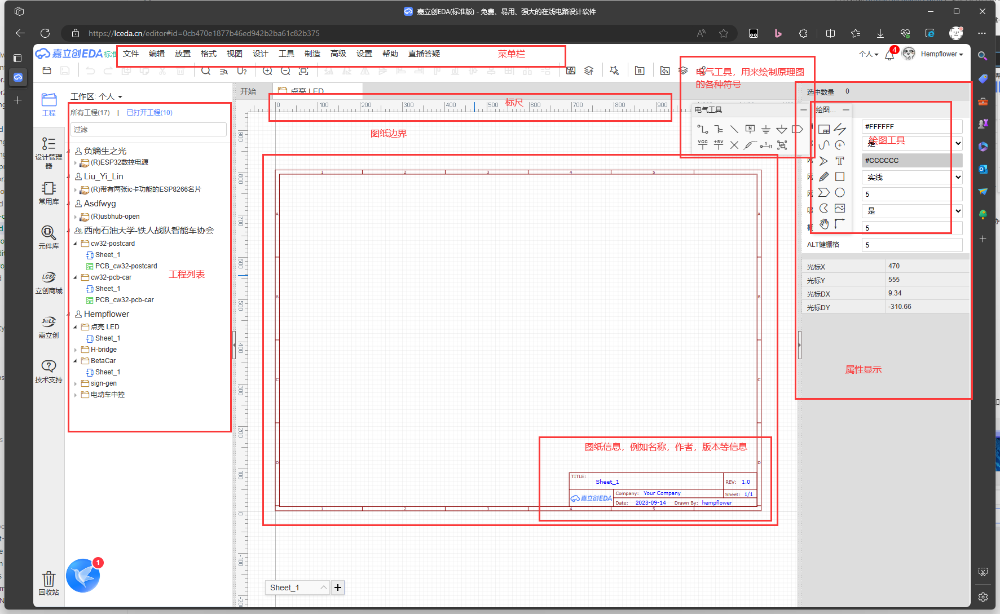

常用的界面区域包括：

1. 菜单栏：提供了大量的功能，例如文件操作、编辑操作、查看操作、工具操作等。
2. 图纸区：用于显示当前编辑的图纸，原理图的在图纸内绘制。
3. 电气工具: 提供绘制原理图的常用工具，例如导线连接，电源标识，接地标识等。
4. 绘图工具：提供绘制图纸的常用工具，例如矩形、圆形、直线、文本等。
5. 常用库：提供了基础的元器件，例如电阻、电容、二极管、晶体管、排针等。
6. 属性栏：用于设置当前选中元素的属性，例如元件的值、封装、引脚等。

直接介绍他们的功能很晦涩，我们在后续的教程中会逐步学习这些功能。

## 绘制原理图

### 绘制 LED 元件
现在我们可以来绘制原理图了。首先，我们需要在图纸区绘制一个 LED 元件。LED 元件在常用库中，我们在常用库中找到 LED 元件后，点击一下，然后将鼠标移动到图纸区，点击鼠标左键，即可绘制一个 LED 元件。

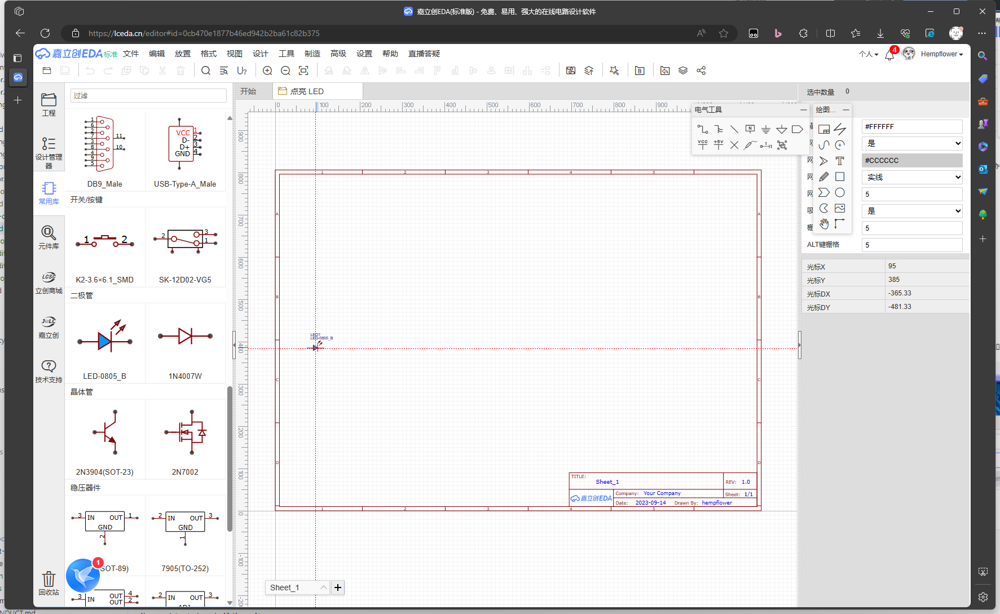

> 提示：使用鼠标滚轮可以放大和缩小图纸。

好了，现在你迈出了原理图绘制的第一步。

### 绘制电源接口

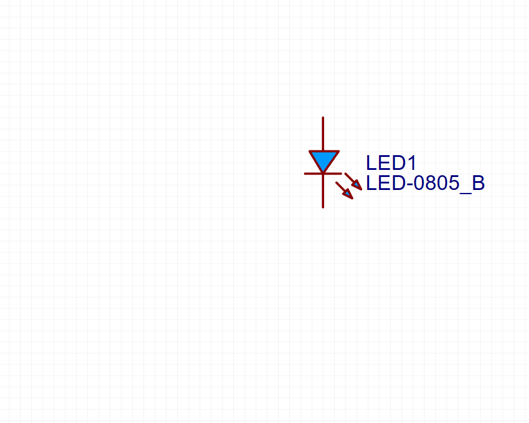

根据我们曾经学过的电路知识，只有一个二极管是无法点亮的，我们需要给它提供电源。      

但是不同于以往高中学习的电路，我们实际的电路模块通常使用的是外部提供的直流电源，而不是自带一块电池，因此我们只需要留一个供电的接口即可，我们假定使用 3V3 的电源进行供电。     

接口的种类众多，各有优劣，我们这里选择最简单的排针接口。在常用库中找到排针接口，点击右下角箭头将类别选择为1x2，再次点击元件。然后将鼠标移动到图纸区，点击鼠标左键，即可绘制一个排针接口。

> 如下图所示，在常用库中点击元件右下角的箭头可以选择不同参数的元件。

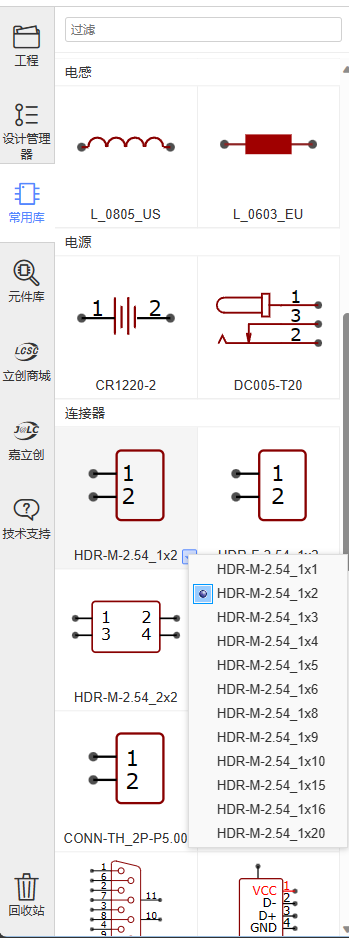

### 将元件连接在一起

目前看起来一切顺利，只需要将元件连接起来就可以了。      
将鼠标靠近引脚末端，左键点击，就可进入连线状态，然后将鼠标移动到另一个元件的引脚末端，再次点击鼠标左键，即可将两个元件连接起来。

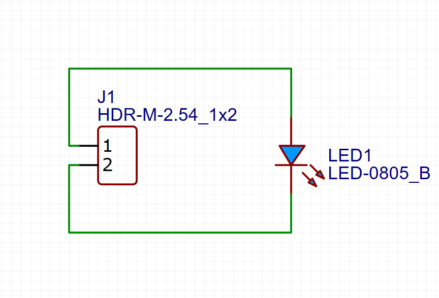

**现在的电路连线看起来有点奇怪？** 明明一个很简单的连接，却绕了一大圈。目前仅有两个元件，如果元件多了，这样的连线方式就会变得非常混乱。因此，我们需要重新调整元件符号的位置和方向，使得连线更加简洁。

> 按 `Esc` 键可以退出连线状态。

#### 删除连线

我们对着连线左键点击，导线会被选中变成红色，然后按下键盘上的 `Del` 键，即可删除连线。

#### 调整元件

通过观察发现，我们只要将排针符号旋转180度，就可以将连线变得简洁。我们对着排针符号左键点击，排针符号会被选中变成红色，然后按下键盘上`空格`键，即可旋转排针符号。

#### 重新连接

现在我们需要重新连接元件，只需要按照原来的步骤进行即可。下图是调整后的连线。

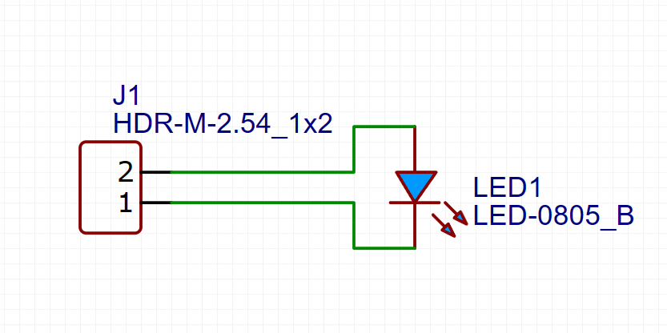

## 保存原理图

现在我们已经完成了原理图的绘制，接下来需要保存原理图。按键盘上的 `Ctrl+S` 快捷键，即可保存原理图。

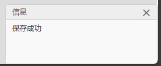

## 电路调整

目前看来，电路似乎是可用的，事实上 LED 也可以发光，但是如果将此电路实际搭建出来，你会发现 LED 发光非常刺眼，甚至会发烫。   

这是因为我们给 LED 提供了过大的电流，LED 的额定电流一般为 20mA 左右(不同二极管略有不同),而我们给它提供了 3.3V 的电压，发光二极管的压降约为0.7V，而电路中导线和电源内阻都是很小的值，这导致 LED 的电流非常大。      

当然，解决方案非常简单，只需要串接一个电阻作为限流电阻即可。我们在常用库中找到电阻元件，然后将它连接在 LED 和电源之间即可。电阻的阻值可以通过计算得到，也可以通过实验得到。我们这里假定 LED 电流为 20mA，电压为 3.3V，那么电阻的阻值可以通过计算得到：

$$
R = \frac{U - 0.7}{I} = \frac{3.3 - 0.7}{0.02} = 130 \Omega
$$

> 公式中的 $U$ 代表电压，$I$ 代表 LED 所需电流，$R$ 代表限流电阻，0.7 代表 LED 的压降。

我们在常用库中找到电阻元件，然后将它连接在 LED 和电源之间。双击阻值文字可以进行修改，我们将阻值修改为 130。

> 设计电路时，阻容元件应选常见参数值，非常见参数值的元件可能会出现缺货、价格高等问题。

## DRC 检查

DRC 检查的全称是 Design Rule Check，即设计规则检查。它可以帮助我们检查原理图中是否存在错误，例如元件连接错误、元件重叠、元件缺失等。我们在左侧工具栏中找到"设计管理器"，即可查看当前的 DRC 检查结果。

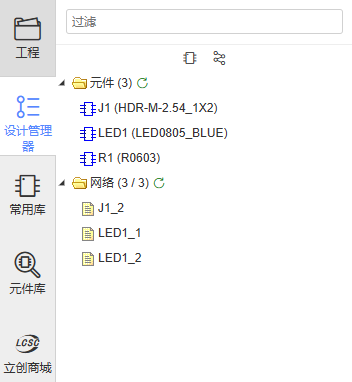

在上图中可以看到，当前的 DRC 检查结果是 0 个错误，这说明我们的原理图没有**基本的**错误。如果存在错误，我们需要根据错误提示进行修改，直到 DRC 检查结果为 0 个错误。