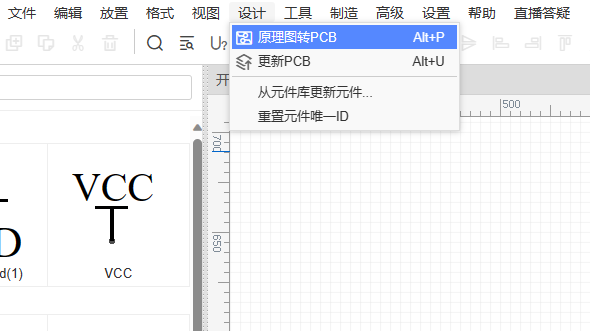
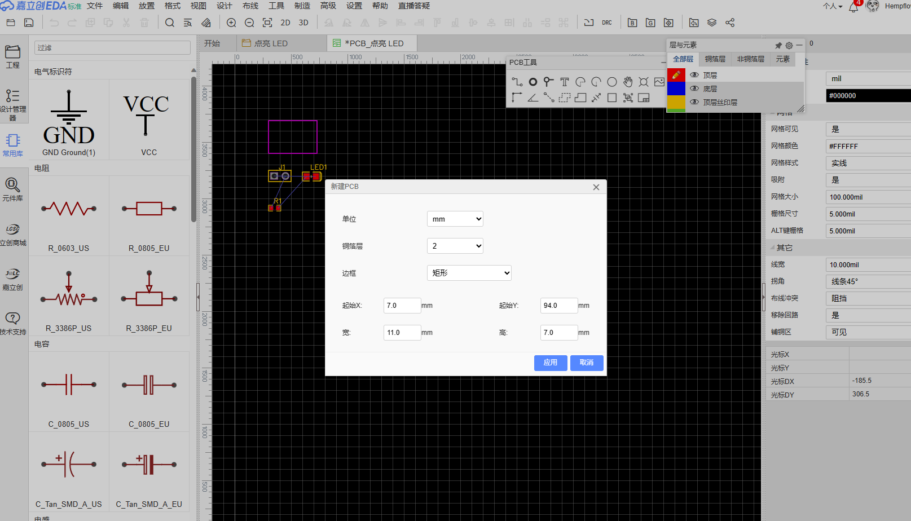
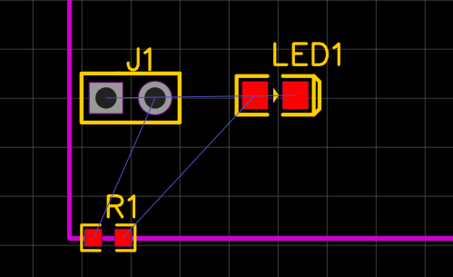
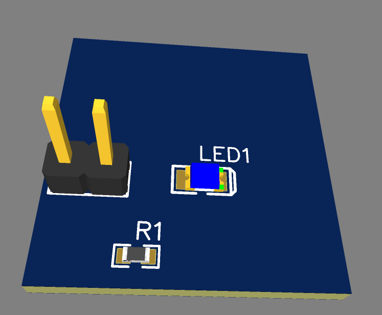
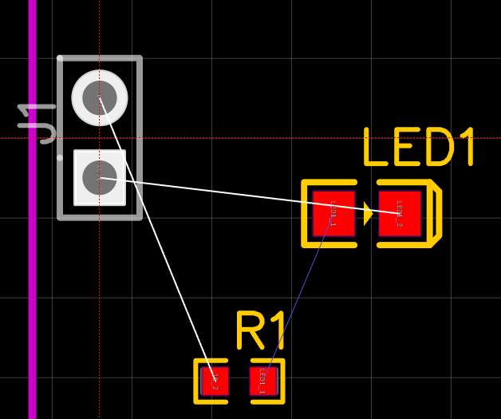
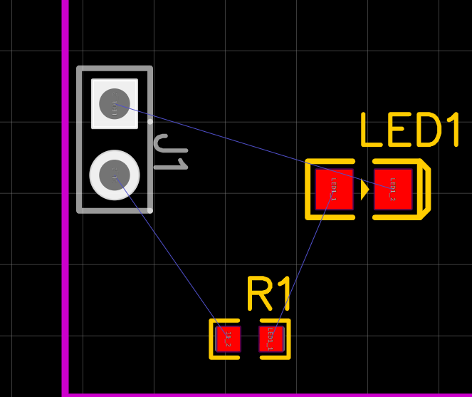
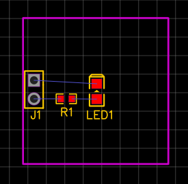
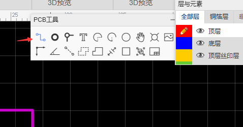
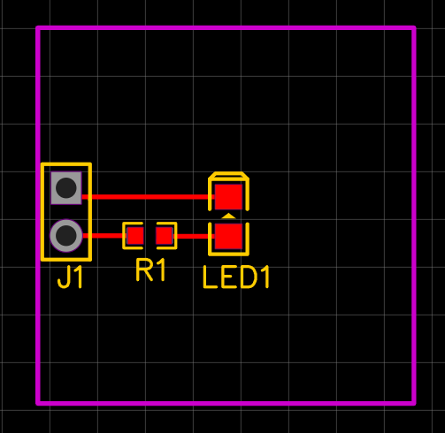
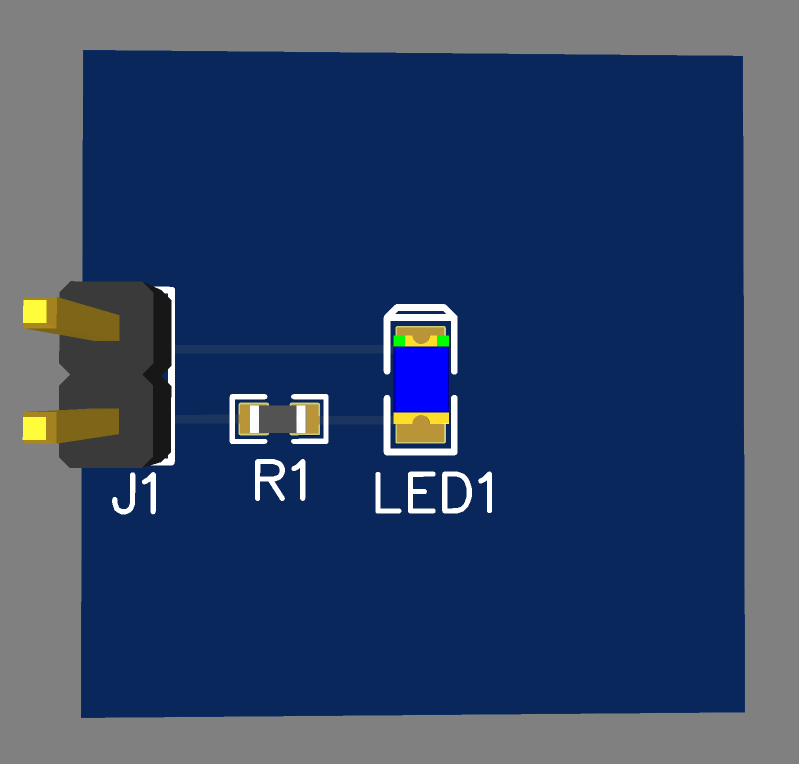

在上一篇教程里，我们介绍了如何使用立创EDA绘制原理图，并绘制了一个简单的 LED 灯电路。但是，我们实际使用的时候，是需要将电路绘制为 PCB 的，这样才能够实际使用。在本篇教程中，我们将学习如何将原理图转换为 PCB，以及如何绘制 PCB。

> PCB: Printed Circuit Board，印刷电路板，我们也俗称电路板，是电子产品的基础，用于连接电子元件，实现电子元件之间的连接。

## 原理图转 PCB

打开我们上一次教程中的原理图，点击菜单"工具"-"原理图转 PCB"，就可以将原理图转换为 PCB。

编辑器会自动检查原理图中的错误，如果没有错误，就会自动创建 PCB 文件。

我们在新建 PCB 的窗口中，可以设计 PCB 的尺寸、层数、边框等，这里我们设置 PCB 的尺寸为 20mm x 20mm，层数为 2 层，边框为矩形。

## 认识封装

在编辑器中，我们可以看到有这样的元素

这个就是原理图中元件对应的**封装**，封装一般定义了元件的引脚、尺寸、形状等信息，它是元件的物理实体。

电阻电容的贴片封装就是长方体，常见的贴片封装有 0402、0603、0805、1206 等，数字代表了封装的尺寸，0402 就是 0.4mm x 0.2mm，0603 就是 0.6mm x 0.3mm，以此类推。

作为初学者，我们不需要自己设计封装，可以直接使用现成的封装。如果你从来没有见过元件的真实外形，可以点击上方的 3D 按钮查看元件的 3D 模型了解一下元件的外形，以便更好的布局。

## 元件布局

PCB 的布局描述起来很简单，就是一个调整元件位置和方向的过程。我们使用鼠标拖动元件调整位置，按空格键旋转元件。不过，这个过程中需要注意以下几点：

- 接口等需要与外部连接的元件，需要靠近 PCB 边缘，以便连接
- 元件之间需要保持一定的距离，以免难以焊接
- 按键等需要人操作的元件，需要放在 PCB 边缘，并且不能有影响操作的元件挡住

这是最简单的布局规则，后续我们会学习更多的 PCB 布局规则。

仔细观察元件之间，你会发现元件之间有很细的连线，这是元件之间的飞线，它们是自动生成的，用于表示元件之间的连接关系。我们可以通过拖动元件来观察飞线的变化，以便更好的布局。

调整前：

调整后：

经过简单的调整，现在 PCB 的布局如下：

你可以按照自己的想法来布局，只要保证后续方便连线，并且不影响使用即可。

## 走线

在布局完成后，我们需要将元件之间的飞线转换为真实的连线，这个过程叫做走线。走线的过程中，我们需要注意以下几点：

- 线应该尽量短，以减少电阻
- 同一层的线不能交叉，否则会短路
- 不同层的线可以交叉，但是需要通过过孔连接

按下 W 键，或者选择 PCB 工具中的导线，即可进入走线模式。我们对着元件的**焊盘** (红色的圆形或方形) 点击鼠标左键，然后移动鼠标，即可绘制导线。导线绘制到目标焊盘后，点击目标焊盘，即可完成导线的绘制。

按照上面的规则，我们可以将 PCB 走线如下：

一个简单的 PCB 就完成了，我们可以点击 3D 按钮查看 PCB 的 3D 模型。

当然，不要忘记保存 PCB，点击菜单"文件"-"保存"，或者按下快捷键`Ctrl+S`，即可保存 PCB。