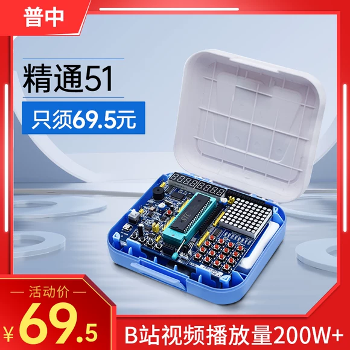
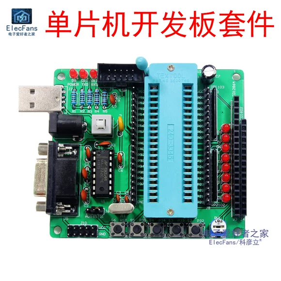
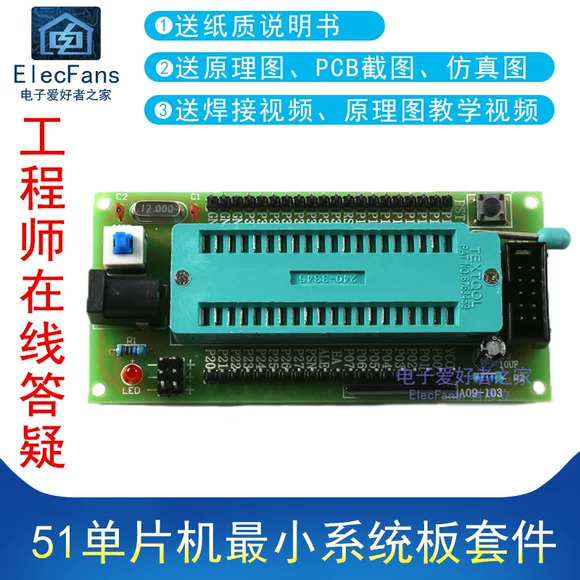

在开始一个项目之前，我们往往需要确定我们要使用的单片机型号，以及用来开发的开发板。在这一节中，我们将会介绍一些常见的单片机型号，以及我们推荐的开发板。

## 51 开发套件

这个应该再熟悉不过了，51 开发套件是我们最常用的开发板。它的特点是价格低廉，易于上手。但是它的性能较低，不适合做一些复杂的项目。     
淘宝上有很多 51 开发套件，如下图所示：

开发套件种类繁多，价格也不尽相同。如果仅仅是学习目的，而且预算不多，那么不需要购买过于豪华的套件，因为大部分模块我们可能都用不到。我们推荐购买一个最小系统板，再自行选择一些需要的模块来学习。

> 最小系统板: 仅包含单片机，晶振，电源等最基本的模块，不包含其他的模块。

要进行 51 开发，以下几个模块是必不可少的：

- 51 单片机
- 51 最小系统板
- USB 转 TTL 模块(下载调试)

下面的链接是我们推荐的一款 51 开发板，供大家参考：

[51 单片机最小系统板购买链接](https://detail.tmall.com/item.htm?id=733700900367&skuId=5074892596286)

## STM32 开发套件

STM32 是一款非常流行的单片机，相比 51， STM32 有更强大的性能，更多的外设，更多的存储空间。因此，STM32 适合做一些复杂的项目。当然，要学习的内容也变得更多了。    

另外由于 STM32 巨大的份额，市面上有很多兼容 STM32 芯片，也就是说，学习了 STM32 之后，你可以很容易的上手其他的类似 STM32 芯片。

> 国产芯片例如 GD32，它是一款兼容 STM32 的单片机，与 STM32 二进制兼容。

STM32 开发所需的模块如下：

- STM32 单片机最小系统板
- ST-LINK 调试器 (烧录程序，调试程序)

推荐的购买链接如下:

- [STM32 单片机最小系统板](https://detail.tmall.com/item.htm?id=696397714719&skuId=4941053489542)
- [ST-LINK](https://detail.tmall.com/item.htm?id=696397714719&skuId=4941053489543)

由于智能车竞赛中大家最为熟悉的单片机主要以 STM32 和 51 两种类型为主，因此其他类型的单片机我们不做过多介绍。如果你对其他类型的单片机感兴趣，可以自行学习。

## 选择开发板

我们更推荐你使用 STM32 开发，因为它的性能更好，更适合做一些复杂的项目。而且价格也并不比 51 更贵。