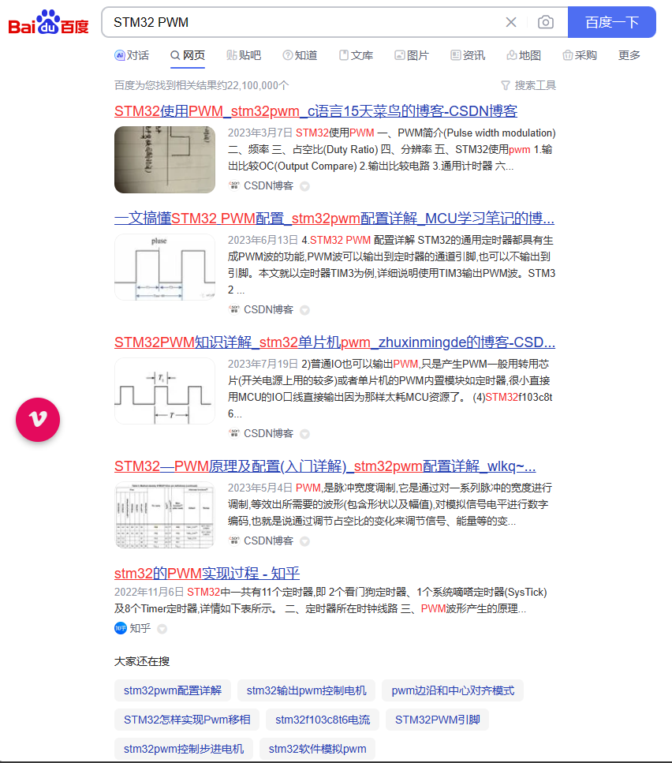

在上一篇教程中已经介绍了常见的开发板，以及我们推荐的开发板。当开发板入手后，就应该开始学习如何使用它了。在这一节中，我们会分享一些常用的资料，以及如何寻找资料。

## 51 系列单片机资料

### 视频教程

- [江协科技51单片机入门教程](https://www.bilibili.com/video/BV1Mb411e7re/)
- [普中科技51单片机入门教程](https://www.bilibili.com/video/BV1RB4y1i71i)
- [夏老师51单片机入门教程](https://www.bilibili.com/video/BV1Kt411Q7aV)

### 文档类教程

- [51 单片机资料汇总](https://yun.baidu.com/s/1dDLcIad)
- [51 单片机教程](https://yun.baidu.com/s/1hrgdEfU)

### 代码，例程

- [实验例程源码](https://pan.baidu.com/s/1gcGS4SLDmbmlOvTHZSkcnw) 提取码:qulo
- [单片机c语言程序设计实训 100 例](https://yun.baidu.com/s/1jI8hD1G)

### 手册，官网

- [STC 官网](http://www.stcmcudata.com/) (下载数据手册等资料)


## STM32 系列单片机资料

### 视频教程

- [江协科技](https://www.bilibili.com/video/BV1th411z7sn)
- [正点原子](https://www.bilibili.com/video/BV1bv4y1R7dp)
- [WUT-电子科技协会](https://www.bilibili.com/video/BV1q4411d7RX)

### 文档类教程

- [野火教程](https://doc.embedfire.com/mcu/stm32/f103/hal_generalzh/latest/doc/chapter1/chapter1.html)
- [stm32-tech.readthedocs.io](https://stm32-tech.readthedocs.io/en/latest/base/00%E5%89%8D%E8%A8%80.html)
- [ stm32入门教程(hal库)pdf](https://yun.baidu.com/s/1gffZ0Pl)
  
### 代码，例程

- [STM32标准外设库、HAL库、LL库的下载地址](https://zhuanlan.zhihu.com/p/425059755)

### 手册，官网

- [ST 官网](https://www.st.com/)


## 查阅资料的方法和技巧

如何寻找资料是一个非常重要的技能，因为在学习的过程中，我们经常会遇到一些问题，而这些问题并不一定能够在教程中找到答案。因此，我们需要学会如何寻找资料。

### 遇到 XX 功能如何实现的问题

比如，现在我们想知道如何使用 STM32 输出 PWM 信号，那么我们可以在搜索引擎中输入以下关键词：
```
STM32 PWM
```



对于 STM32 这种热门的芯片，我们可以轻松的找到大量的资料。但是对于一些冷门国产的芯片，我们可能会找不到相关的资料。此时，我们可以尝试搜索技术类型类似的芯片，例如 STM32 和 GD32 是兼容的，因此我们可以搜索 STM32 PWM，然后在搜索结果中寻找相关的教程资料。

另外要注意一点，搜索的时候，型号信息应该缩短，例如 STM32F103C8T6，我们可以缩短为 STM32F103，因为 STM32F103C8T6 是 STM32F103 系列的一种型号。

> 练习: 请尝试通过搜索的方式了解如何使用 mm32f3277g9p MCU 输出 PWM 信号。

### 需要了解单片机寄存器等详细信息的情况

这类信息请前往官网查看，例如 STM32 的官网是 [https://www.st.com/](https://www.st.com/)，在官网中，我们可以找到 STM32 的数据手册，参考手册等资料。


### 遇到XX工具报错的问题

这类问题最为关键的是报错信息，我们需要将报错信息复制到搜索引擎中，然后搜索。例如，我们在使用 Keil 编译器的时候，遇到了以下报错信息：

```
Error: L6218E: Undefined symbol HAL_UART_Transmit in function main
```

如果搜索结果比较少，可以尝试将报错信息中的关键词缩短，例如我们可以搜索以下关键词：

```
L6218E: Undefined symbol HAL_UART_Transmit
```
缩短的方法很简单，就是将报错信息中的一些无关紧要的信息去掉，例如这里的 Error，function main 等信息。

> 练习: 请尝试通过搜索的方式查找报错的原因：
> ```
> Flash Download failed - Target DLL has been cancelled
> ```

## 有用的网站

- [百度](https://www.baidu.com/)
- [谷歌](https://www.google.com/)
- [网盘搜索](http://www.vpansou.com/)
- [Gitee](https://gitee.com/)
- [Github](https://github.com/)
- [stackoverflow](https://stackoverflow.com/)