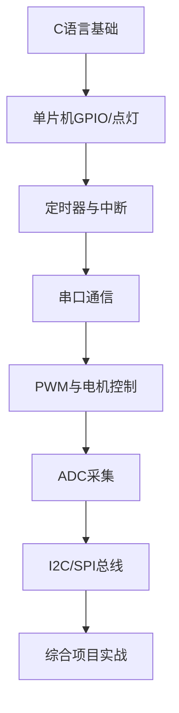
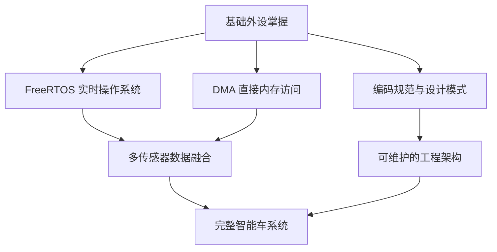

这一篇教程也就到这里结束了，接下来你可以选择以下几个方向进行深入学习。

## 学习路线图

### 基础路线：从入门到能做项目



### 进阶路线：从会用到会用得好



## 推荐的学习顺序

### 第一步：巩固单片机基础（2-3 周）

以下知识点是智能车开发中最常用的，建议逐个掌握：

| 优先级 | 知识点 | 用途 | 建议时间 |
|--------|--------|------|---------|
| ⭐⭐⭐ | GPIO 输入/输出 | 按键、LED、继电器控制 | 1-2天 |
| ⭐⭐⭐ | 定时器中断 | 精确计时、周期性任务 | 2-3天 |
| ⭐⭐⭐ | PWM 输出 | 电机调速、舵机控制 | 2-3天 |
| ⭐⭐⭐ | UART 串口 | 调试输出、模块通信 | 1-2天 |
| ⭐⭐ | ADC 采集 | 模拟传感器读取 | 2-3天 |
| ⭐⭐ | I2C 总线 | 陀螺仪、OLED 通信 | 2-3天 |
| ⭐⭐ | SPI 总线 | 高速传感器、LCD | 2-3天 |
| ⭐ | 编码器输入 | 测速、里程计 | 1-2天 |

### 第二步：学习编码规范（持续进行）

好的代码不仅要能跑，更要让人看得懂。建议尽早养成良好的编码习惯：

- **命名规范**：变量名、函数名要有意义（禁止 `a`、`b`、`temp1` 这种命名）
- **注释习惯**：关键逻辑必须注释，修改代码时同步更新注释
- **模块化**：把不同功能的代码放在不同文件中，避免一个 `main.c` 写到底
- **宏定义**：用宏定义替代魔数（写 `#define LED_PIN 13` 而不是直接写 `13`）

推荐阅读：[嵌入式 C 语言编码规范](https://github.com/MaJerle/c-code-style)

### 第三步：做一个小项目（1-2 周）

理论知识学再多，不如动手做一个真实项目。推荐以下项目作为练手：

1. **呼吸灯** — 练习 PWM 和定时器
   - 难度：⭐
   - 知识点：PWM、定时器

2. **温湿度监控** — 练习传感器读取和串口输出
   - 难度：⭐⭐
   - 知识点：I2C/DHT11、UART、数据格式化

3. **蓝牙遥控小车** — 练习多模块整合
   - 难度：⭐⭐⭐
   - 知识点：UART(蓝牙)、PWM(电机)、GPIO、中断

4. **超声波测距仪** — 练习输入捕获和显示
   - 难度：⭐⭐
   - 知识点：定时器输入捕获、OLED 显示

5. **简易示波器** — 练习 ADC 和上位机通信
   - 难度：⭐⭐⭐
   - 知识点：ADC、DMA、串口高速传输、上位机显示

这些项目的代码都应该用 Git 管理起来，方便回顾和展示。

## 加入团队协作

掌握了基础技能后，你可以开始参与团队的协作开发：

1. **了解团队代码库**：从团队的 Git 仓库克隆代码，阅读已有的代码
2. **从小任务开始**：先修复简单的 Bug，再逐渐接手功能开发
3. **参与 Code Review**：看别人的代码修改能学到很多
4. **多问为什么**：不理解的地方主动提问，不要照搬代码

## 持续学习的资源

- **芯片手册**：STM32 参考手册（Reference Manual）是最权威的学习资料
- **开源项目**：在 GitHub/Gitee 上搜索 "智能车" "STM32小车" 等关键词
- **技术博客**：CSDN、博客园上的高质量文章
- **视频教程**：Bilibili 上硬木课堂、正点原子等机构的系列教程
- **技术社区**：[ebaina](https://www.ebaina.com/)、[STM32中文社区](https://www.stmcu.com.cn/)

## 编码规范速查

以下是几条最重要的编码规范，从现在开始就养成习惯：

```c
// 1. 使用有意义的命名
int motor_speed;        // ✓ 好
int ms;                 // ✗ 不好

// 2. 宏定义替代魔数
#define LED_PIN GPIO_PIN_13  // ✓ 好
HAL_GPIO_WritePin(GPIOC, 13, GPIO_PIN_SET);  // ✗ 不好

// 3. 函数单一职责
void motor_init(void);       // ✓ 好
void motor_control(int speed); // ✓ 好
void motor_init_and_run(void); // ✗ 做太多事情

// 4. 关键逻辑加注释
// 使用位置式 PID 算法计算电机控制量
int pid_output = Kp * error + Ki * integral + Kd * derivative;

// 5. 合理的文件结构
// motor.h — 函数声明
// motor.c — 函数实现
// main.c  — 主逻辑（尽量简短）
```

---

> 与其说是教程，不如说这是一系列指南。我们希望通过这些指南，能够帮助大家快速上手单片机的开发。学习过程中遇到任何问题，随时在群里提问，或者联系学长学姐。
>
> 加油，期待在智能车实验室见到你！🚗💨
