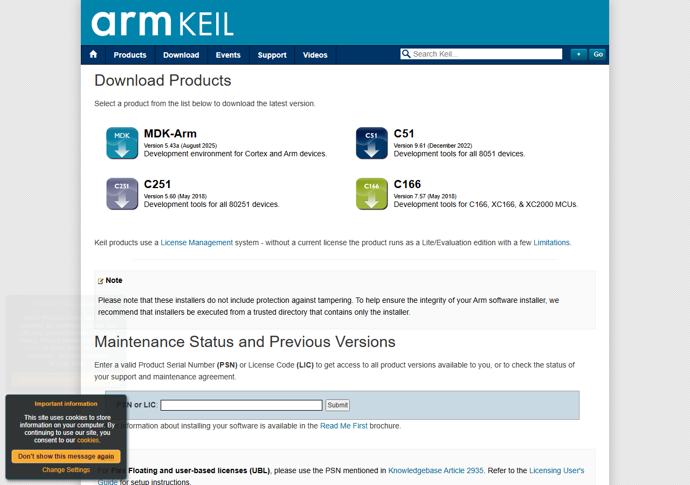
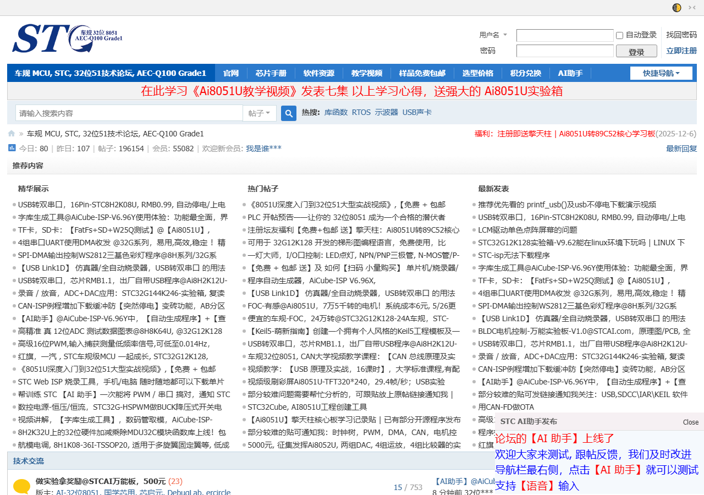
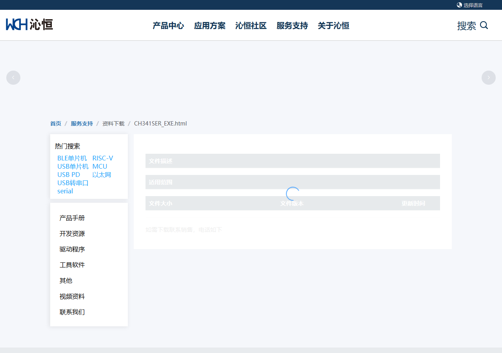
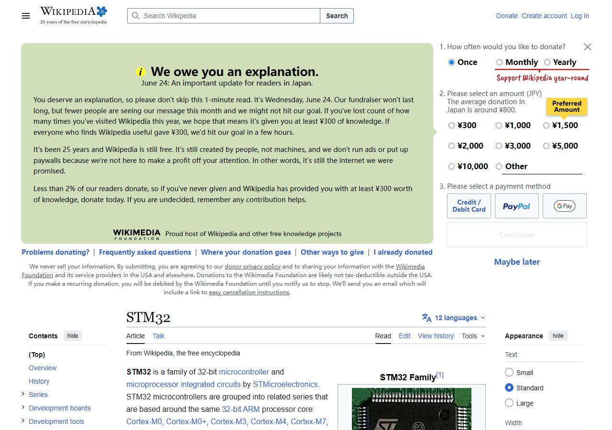
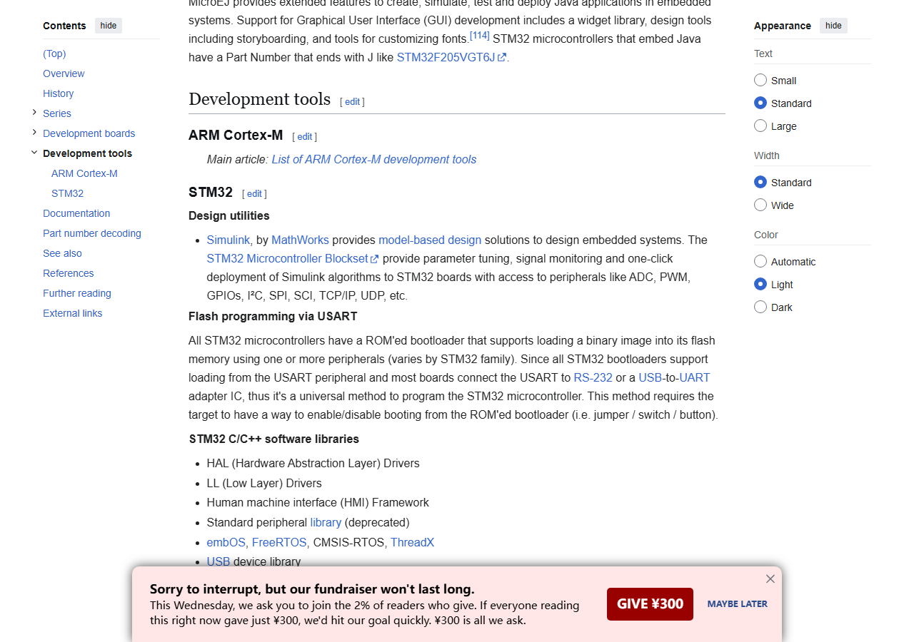

经过前面几节的学习，你应该已经选好了开发板，也找到了学习资料。现在，是时候动手搭建开发环境了。本节将带你完成从零开始的开发环境搭建。

## 整体流程概览

无论你使用哪种单片机，开发环境的搭建大致包含以下步骤：

1. **安装 IDE（集成开发环境）** — 用于编写、编译、调试代码
2. **安装编译器/工具链** — 将 C 代码编译为单片机可执行的机器码
3. **安装下载器驱动** — 让电脑能够与下载器（ST-LINK、USB-TTL 等）通信
4. **创建第一个工程** — 验证环境是否搭建成功

## 51 单片机开发环境

### Keil C51

Keil C51 是 51 单片机最经典的开发环境，虽然界面比较"复古"，但胜在稳定可靠。

#### 下载与安装

1. 访问 Keil 官网下载页面：[https://www.keil.com/download/product/](https://www.keil.com/download/product/)
2. 找到 **C51** 分类，点击下载最新版本
3. 运行安装程序，按照默认选项完成安装

#### 注册与激活

Keil C51 需要激活才能编译超过 2KB 代码。对于学习目的：

- 可使用评估版（有代码大小限制，对入门学习影响不大）
- 学校实验室通常有教育授权

> STC 官方的 **AIapp-ISP** 烧录工具中也内置了编译器配置向导，可以帮助快速搭建环境。

### STC-ISP 烧录工具

STC 单片机的程序烧录需要使用 STC-ISP 工具：

1. 访问 STC 官网：[http://www.stcmcudata.com/](http://www.stcmcudata.com/)
2. 下载最新版 **AIapp-ISP** 烧录软件
3. 该工具同时提供了串口助手、范例程序等实用功能

### USB 转 TTL 驱动

51 开发板通常通过 USB 转 TTL 模块（CH340/CH341 芯片）烧录程序：

1. 将 USB 转 TTL 模块插入电脑 USB 口
2. 下载 CH340 驱动：[http://www.wch.cn/downloads/CH341SER_EXE.html](http://www.wch.cn/downloads/CH341SER_EXE.html)
3. 安装驱动后，在设备管理器中确认串口号（如 `COM3`）

### 验证安装

1. 打开 Keil C51，新建一个简单工程
2. 编写 LED 闪烁代码（参考开发板例程）
3. 编译工程，确认无报错
4. 使用 STC-ISP 工具将生成的 HEX 文件烧录到开发板
5. 观察开发板上的 LED 是否按预期闪烁

---

## STM32 开发环境

STM32 的开发环境选择较多，常见的有：

| IDE | 特点 | 适合人群 |
|-----|------|---------|
| **Keil MDK** | 经典、稳定、教程多 | 初学者、传统开发 |
| **STM32CubeIDE** | ST 官方出品、免费、集成 CubeMX | 初学者、STM32 专属 |
| **CLion + GCC** | 现代化、跨平台 | 有经验的开发者 |
| **VS Code + PlatformIO** | 轻量、开源 | 喜欢折腾的开发者 |

### 方案一：Keil MDK（推荐入门）

Keil MDK 是 ARM 生态中最成熟的 IDE 之一，网上的 STM32 教程大多基于 Keil。

#### 下载与安装

1. 访问 Keil MDK 下载页：[https://www.keil.com/download/product/](https://www.keil.com/download/product/)
2. 找到 **MDK-Arm** 分类，下载最新版本
3. 运行安装程序，注意：
   - 安装路径不要包含中文
   - 当提示安装器件包时，勾选 `STM32F1xx` 系列

#### 安装器件包

如果安装过程中没有安装器件包，可以后续手动安装：

1. 打开 Keil MDK，点击工具栏的 **Pack Installer** 图标
2. 在搜索框中输入 `STM32F103`
3. 找到对应系列，点击 `Install`

#### 注册

Keil MDK 同样需要激活。对于学习目的：
- 可使用评估版（32KB 代码限制，足够入门学习）
- 或者搜索 "Keil MDK 社区版" 获取免费许可

### 方案二：STM32CubeIDE（ST 官方推荐）

STM32CubeIDE 是 ST 官方出品的免费 IDE，集成了 CubeMX 图形化配置工具。

#### 下载

1. 访问 ST 官网：[https://www.st.com/en/development-tools/stm32cubeide.html](https://www.st.com/en/development-tools/stm32cubeide.html)
2. 需要注册 ST 账号（免费）
3. 选择对应操作系统版本下载

> CubeIDE 安装包较大（约 1-2GB），下载和安装需要较长时间，请耐心等待。

#### 特点

- **完全免费**，无代码大小限制
- 内置 **STM32CubeMX**，可图形化配置引脚、时钟、外设
- 自动生成初始化代码，大幅降低上手难度
- 仅支持 STM32 系列（不支持 51 等其他 MCU）

### ST-LINK 驱动

ST-LINK 是 STM32 的调试/烧录器，需要安装驱动：

1. 将 ST-LINK 插入电脑 USB 口
2. Windows 10/11 通常会自动安装驱动
3. 如果未自动安装，从 ST 官网下载：[https://www.st.com/en/development-tools/stsw-link009.html](https://www.st.com/en/development-tools/stsw-link009.html)
4. 在设备管理器中确认出现 `ST-Link Debug` 设备

### 验证安装（以 Keil MDK 为例）

1. 下载一个 STM32F103 的 LED 闪烁例程
2. 用 Keil MDK 打开工程文件（`.uvprojx`）
3. 点击 **Build**（或按 `F7`）编译，确认 `0 Error(s)`
4. 连接 ST-LINK 到开发板，点击 **Download**（或按 `F8`）
5. 按下开发板复位键，观察 LED 是否闪烁

---

## VS Code 辅助开发（可选）

虽然 VS Code 不能完全替代专业 IDE，但作为代码编辑器和辅助工具非常实用：

1. 访问 [https://code.visualstudio.com/](https://code.visualstudio.com/) 下载安装
2. 推荐安装的插件：
   - **C/C++** (Microsoft) — C 语言语法高亮、智能提示
   - **Chinese (Simplified)** — 中文界面
   - **GitLens** — Git 增强工具
   - **Keil Assistant** — 可直接在 VS Code 中调用 Keil 编译

---

## 常见问题

### 编译报错：找不到头文件

- 检查 Keil 的 **Options → C/C++ → Include Paths** 是否包含所需头文件目录
- STM32 工程需要正确设置 `STM32F10x_StdPeriph_Lib` 等标准库路径

### 烧录失败：找不到设备

- 检查下载器是否插好，驱动是否安装
- 检查开发板是否供电（有些下载器不给目标板供电）
- 在 Keil 的 **Options → Debug → Settings** 中确认能识别到调试器

### CH340 驱动安装后仍不识别

- 尝试更换 USB 数据线（有些数据线只能充电不能传数据）
- 更换 USB 口重试
- 去沁恒官网下载最新驱动

---

## 下一节

环境搭建完成后，下一节我们将学习如何使用 **版本控制工具（Git）** 来管理你的代码，这在团队协作中至关重要。
