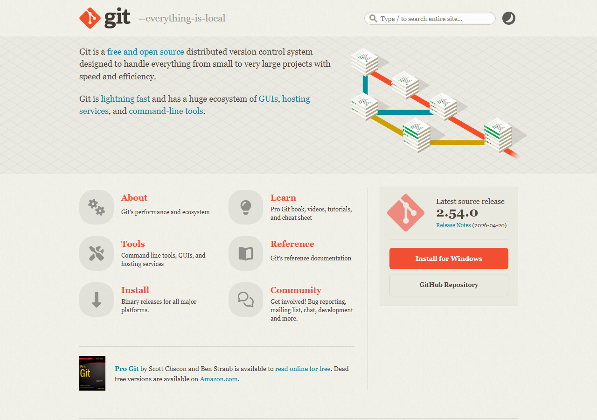
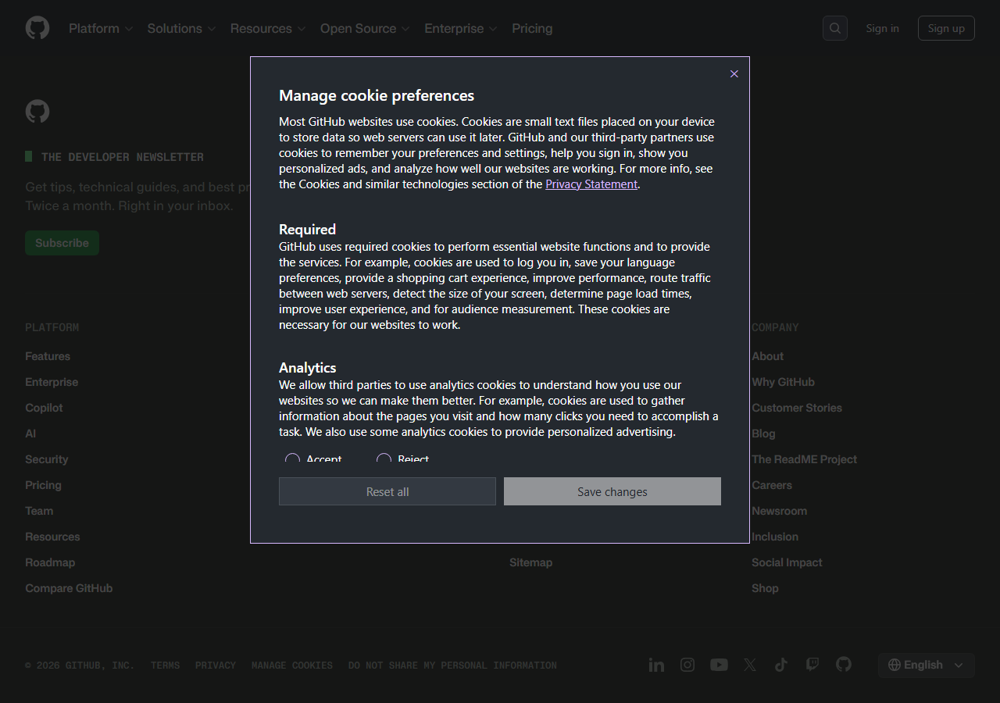
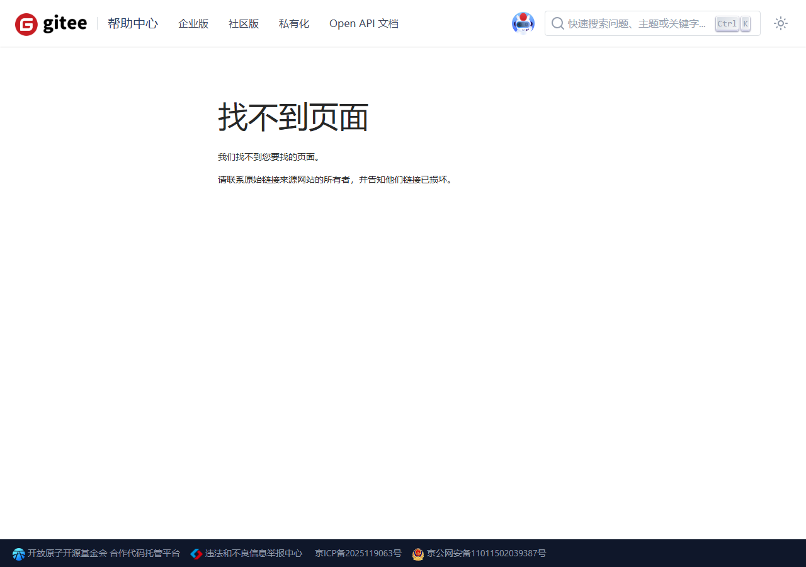

在开发过程中，你是否遇到过这些问题：

- 修改代码后程序出错了，但不记得改了什么？
- 想尝试一个新功能，又怕搞乱已有的代码？
- 团队成员各自修改代码，合并时冲突不断？
- 电脑硬盘坏了，代码全部丢失？

**版本控制**就是为了解决这些问题而生的。

## 什么是版本控制

版本控制（Version Control）是一种记录文件变化的系统，它能让你：

- **回溯历史**：随时查看任意历史版本的代码
- **分支开发**：在不影响主代码的情况下尝试新功能
- **团队协作**：多人同时修改代码，自动合并
- **备份恢复**：代码托管在远程服务器，不怕丢失

版本控制的核心概念就像玩游戏时的"存档"——你可以随时回到之前的存档点，也可以尝试不同的路线。

## 为什么学 Git

Git 是目前世界上最流行的版本控制系统，由 Linux 之父 Linus Torvalds 开发。它的优势：

- **分布式**：每个人的电脑都有完整的版本历史
- **速度快**：大部分操作在本地完成，不需要网络
- **分支强大**：创建和切换分支几乎瞬间完成
- **生态丰富**：GitHub、Gitee 等平台提供了丰富的协作功能

作为智能车团队的成员，Git 是必须掌握的技能。团队的代码、电路设计、文档全部使用 Git 管理。

## 安装 Git

### Windows

1. 访问 Git 官网：[https://git-scm.com/downloads](https://git-scm.com/downloads)
2. 下载 Windows 版本安装包
3. 运行安装程序，大部分选项保持默认即可
4. 推荐勾选：
   - **Windows Explorer Integration** — 右键菜单集成
   - **Use Visual Studio Code as Git's default editor** — 如果你安装了 VS Code

安装完成后，在任意文件夹右键，选择 **Git Bash Here** 打开 Git 终端，输入以下命令验证安装：

```bash
git --version
# 输出类似: git version 2.43.0
```



### 初次配置

安装后需要配置用户名和邮箱（这些信息会记录在你的每次提交中）：

```bash
git config --global user.name "你的姓名"
git config --global user.email "你的邮箱@example.com"
```

> 如果你使用 GitHub 或 Gitee，建议使用与平台注册一致的邮箱。

---

## Git 基本概念

在开始使用前，先了解几个核心概念：

| 概念 | 说明 | 类比 |
|------|------|------|
| **仓库 (Repository)** | 存放项目代码和版本历史的地方 | 项目的"档案室" |
| **工作区 (Working Directory)** | 你正在编辑的文件 | 你的桌面 |
| **暂存区 (Staging Area)** | 准备提交的文件列表 | "待办清单" |
| **提交 (Commit)** | 将暂存区的文件存入版本历史 | 按下"存档"按钮 |
| **分支 (Branch)** | 独立的开发线路 | 平行宇宙 |
| **远程仓库 (Remote)** | 托管在服务器上的仓库 | 云端备份 |

### Git 工作流程

```
工作区 → git add → 暂存区 → git commit → 本地仓库 → git push → 远程仓库
   ↑                                                          ↓
   └──────────────── git pull ────────────────────────────────┘
```

---

## Git 基本操作

### 创建仓库

在项目文件夹中初始化 Git 仓库：

```bash
cd my-smartcar-project
git init
```

这会创建一个隐藏的 `.git` 文件夹，用于存储版本信息。

### 查看状态

```bash
git status
```

这个命令非常重要，它会告诉你：
- 哪些文件被修改了
- 哪些文件在暂存区等待提交
- 当前在哪个分支

### 添加文件到暂存区

```bash
# 添加单个文件
git add main.c

# 添加当前目录所有文件
git add .

# 添加所有 .c 文件
git add *.c
```

### 提交（存档）

```bash
git commit -m "描述这次修改了什么"
```

提交信息（commit message）应该简洁明了地描述修改内容，例如：

```bash
git commit -m "修复LED闪烁时序bug"
git commit -m "添加串口打印调试功能"
git commit -m "更新引脚配置表"
```

> 好的提交信息能让几个月后的你（以及你的队友）看懂这次改了什么，为什么改。

### 查看历史

```bash
# 查看提交历史
git log

# 简洁的单行模式
git log --oneline

# 图形化显示分支历史
git log --graph --oneline --all
```

### 撤销修改

```bash
# 撤销工作区的修改（回到上次提交的状态）
git checkout -- 文件名

# 取消暂存（从暂存区移出）
git reset HEAD 文件名

# 回退到某个历史版本
git reset --hard 提交ID
```

> `git reset --hard` 会丢弃之后的所有修改，请谨慎使用！

---

## 分支管理

分支是 Git 的核心特性。它让你可以在不影响主代码的情况下开发新功能。

### 为什么需要分支

想象你在开发智能车的电机控制程序。现在程序能正常让车跑了，但你想尝试一种新的 PID 算法。如果直接改代码，改坏了车可能就跑不了了。

用分支就能完美解决这个问题：

```bash
# 基于当前代码创建新分支
git branch pid-experiment

# 切换到新分支
git checkout pid-experiment

# 在上面两条可以合并为
git checkout -b pid-experiment
```

在新分支上放心改动，如果效果好就合并回主分支，不好就直接删掉。

### 常用分支命令

```bash
# 查看所有分支
git branch

# 创建并切换到新分支
git checkout -b feature-xxx

# 切换回主分支
git checkout main

# 合并分支（把 feature-xxx 的改动合并到当前分支）
git merge feature-xxx

# 删除已合并的分支
git branch -d feature-xxx
```

### 合并冲突

当两个人同时修改了同一个文件的同一行时，Git 无法自动判断该用哪个版本，就会产生**合并冲突**。

冲突标记长这样：

```
<<<<<<< HEAD
你修改的代码
=======
队友修改的代码
>>>>>>> feature-xxx
```

解决冲突的步骤：
1. 手动选择保留哪个版本（或合并两者）
2. 删除冲突标记（`<<<<<<<`、`=======`、`>>>>>>>`）
3. `git add` 标记已解决
4. `git commit` 完成合并

---

## 远程仓库

远程仓库让团队可以共享代码、协作开发。国内推荐使用 **Gitee**，国际项目推荐使用 **GitHub**。

### Gitee（码云）使用

1. 访问 [https://gitee.com/](https://gitee.com/) 注册账号
2. 点击右上角 **+** → **新建仓库**
3. 填写仓库名称（如 `smartcar-project`），选择公开/私有
4. 创建完成后，Gitee 会给出仓库地址


将本地仓库关联到 Gitee：

```bash
# 关联远程仓库
git remote add origin https://gitee.com/你的用户名/仓库名.git

# 推送到远程仓库
git push -u origin main
```

### GitHub 使用

流程与 Gitee 类似：

1. 访问 [https://github.com/](https://github.com/) 注册账号
2. 点击右上角 **+** → **New repository**
3. 创建后获取仓库地址



### 常用远程操作

```bash
# 查看关联的远程仓库
git remote -v

# 拉取远程仓库的最新代码
git pull

# 推送本地提交到远程
git push

# 克隆远程仓库到本地
git clone https://gitee.com/用户名/仓库名.git
```

---

## .gitignore 文件

有些文件不需要纳入版本控制，例如：

- 编译生成的中间文件（`.o`、`.hex`、`.elf`）
- IDE 的配置缓存（`.uvoptx`、`Debug/`）
- 本地配置文件
- 敏感信息（密码、密钥）

在项目根目录创建 `.gitignore` 文件：

```gitignore
# Keil 编译输出
*.o
*.d
*.crf
*.lnp
*.axf
*.htm
*.dep
*.iex
*.sct
*.map
*.hex
JLinkSettings.ini
Listings/
Output/
DebugConfig/

# 编辑器
.vscode/
.idea/

# 系统文件
Thumbs.db
Desktop.ini
```

---

## 实战：将考核代码托管到 Gitee

以下是一个完整的工作流程：

```bash
# 1. 进入项目目录
cd ~/my-smartcar-project

# 2. 初始化 Git 仓库
git init

# 3. 创建 .gitignore
cat > .gitignore << 'EOF'
*.o
*.hex
*.elf
*.map
Debug/
Output/
.vscode/
Thumbs.db
EOF

# 4. 添加所有文件并首次提交
git add .
git commit -m "初始提交：考核项目基础代码"

# 5. 关联 Gitee 远程仓库
git remote add origin https://gitee.com/你的用户名/smartcar-project.git

# 6. 推送到 Gitee
git push -u origin main

# 7. 后续每次修改后
git add .
git commit -m "添加xxx功能"
git push
```

---

## 团队协作流程

在实际的智能车开发中，推荐使用以下协作流程：

1. **队长** 创建仓库，设置好 `.gitignore` 和 `README`
2. **每个人** `clone` 仓库到本地
3. **开发新功能** 时，创建新分支（如 `feature/motor-control`）
4. **完成后** 推送到远程，发起 **Pull Request**
5. **队友 Review** 代码后合并到主分支
6. **每次开会前** `git pull` 拉取最新代码



---

## 常见问题

### 推送时提示输入密码太麻烦？

使用 SSH 方式连接（推荐）：

1. 生成 SSH 密钥：`ssh-keygen -t ed25519 -C "你的邮箱"`
2. 将公钥添加到 Gitee/GitHub 的 SSH Key 设置中
3. 使用 SSH 地址关联远程仓库

### 不小心提交了大文件怎么撤回？

```bash
git reset --soft HEAD~1  # 撤销最近一次提交，保留文件修改
```

### 想查看别人的仓库但不用 Git 命令？

Gitee 和 GitHub 都提供了网页版浏览功能，可以直接在浏览器中查看代码。对于查看学习资料和开源项目非常方便。

---

## 推荐资源

- [Git 官方教程](https://git-scm.com/book/zh/v2) — 最好的 Git 学习资料
- [Gitee 帮助中心](https://help.gitee.com/) — Gitee 使用指南
- [GitHub Skills](https://skills.github.com/) — GitHub 官方互动教程
- [Learn Git Branching](https://learngitbranching.js.org/) — 可视化学习 Git 分支

---

版本控制是一项"越早学越受益"的技能。掌握了 Git，你就有了一个强大的"时光机"，可以放心大胆地折腾代码，出了问题随时可以回退。下一节，我们将了解单片机开发中常见的通信协议。
