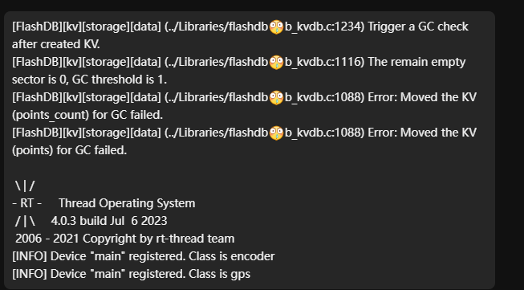
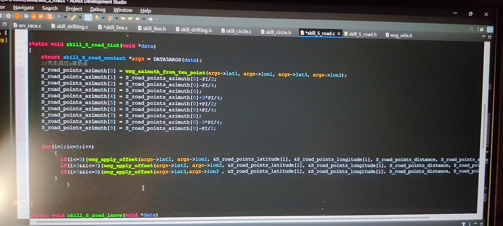

## 关于《提问的智慧》

《提问的智慧》是一篇由[Eric Steven Raymond](https://en.wikipedia.org/wiki/Eric_S._Raymond)所写的文章，它是一篇关于如何在网络上提问的指南。这篇文章的目的是帮助那些在网络上提问的人，能够更快的得到有用的答案。大部分的交流社区都会有类似的指南，但这篇文章是流传最广的。
这篇文章的中文翻译可以在[这里](https://zhuanlan.zhihu.com/p/25258228)阅读。    

在一切开始之前，请务必先阅读这篇文章。这篇文章的内容非常重要，它会帮助你更快的得到有用的答案，也会让你在网络上的交流更加顺畅。~~更重要的是能让学长学姐们不会高血压~~

## 案例展示

下面是一些在网络上提问的案例。在每个案例中，我们都会给出一个正确的示范，以及对应的错误案例。请仔细阅读每个案例，思考其中的差异。

### 案例一

> 背景: 你正在学习 C 语言，但自己编写的代码无法编译通过，你想在网络上寻求帮助。

**错误示范**

> 发出提问: 我的代码无法编译通过，求助。

这种提问既没有描述清楚问题，也没有提供任何有用的信息，这样的提问是无法得到有用的答案的。

**正确示范**

> 发出提问: 我的编写的代码无法编译通过，软件报错如下(附上完整的报错信息)，请问是什么原因导致的呢?

### 案例二

> 背景: 你在基于 51 单片机上开发程序，但却忘记了一些寄存器参数

**错误示范**

> 发出提问: 51 单片机的 P0 寄存器是什么?

这种提问不具有任何的参考价值，因为这个问题的答案可以通过搜索引擎得到。

**正确示范**

> 自行从搜索引擎中搜索答案

### 案例三

> 背景：你在给单片机烧录程序，但是烧录失败了。

**错误示范**

> 发出提问: 为什么单片机程序下载不进去？

这种提问没有提供任何有用的信息，无法得到有用的答案。

**正确示范**

> 发出提问: 我在给单片机烧录程序，但是烧录失败了，我用的是 STC-ISP 烧录软件，烧录失败的报错信息如下(如果有附上完整的报错信息)，请问是什么原因导致的呢?

## 注意事项

### 1. 务必使用 pastebin 等网站发送代码等长文本

如果你需要将长文本发送给他人，请勿直接通过 QQ 发送文本，这样会导致文本格式混乱，也会让对方阅读起来非常困难。例如下图

请使用 pastebin 等网站将文本上传，然后将链接发送给对方。推荐以下网站:

- [https://pastebin.com/](https://pastebin.com/)
- [https://hastebin.com/](https://hastebin.com/)
- [https://gist.github.com/](https://gist.github.com/)
- [https://pastebin.mozilla.org/](https://pastebin.mozilla.org/)

### 2. 除非本人同意，否则不要私聊提问他人

每个人都有自己忙碌的事情，如果你私聊他人提问，会打断他人的工作。如果被提问的人不回复你，那么请不要再次私聊他人。
如果你的问题很紧急，可以在群里提问，但请不要频繁的提问。更不要发送窗口抖动，这样会让他人非常反感。

### 3. 请不要通过拍照的方式截图

如果你需要截图，请使用截图工具截图，不要通过拍照的方式截图。拍照的方式截图会导致图片模糊，也会让对方阅读起来非常困难。如果你还不会截图，可以试试以下几种截图方法：
- Windows 自带的截图工具: `Win + Shift + S`
- QQ 截图: `Ctrl + Alt + A`
- Snipaste: [https://zh.snipaste.com/](https://zh.snipaste.com/)

而不是这样:

